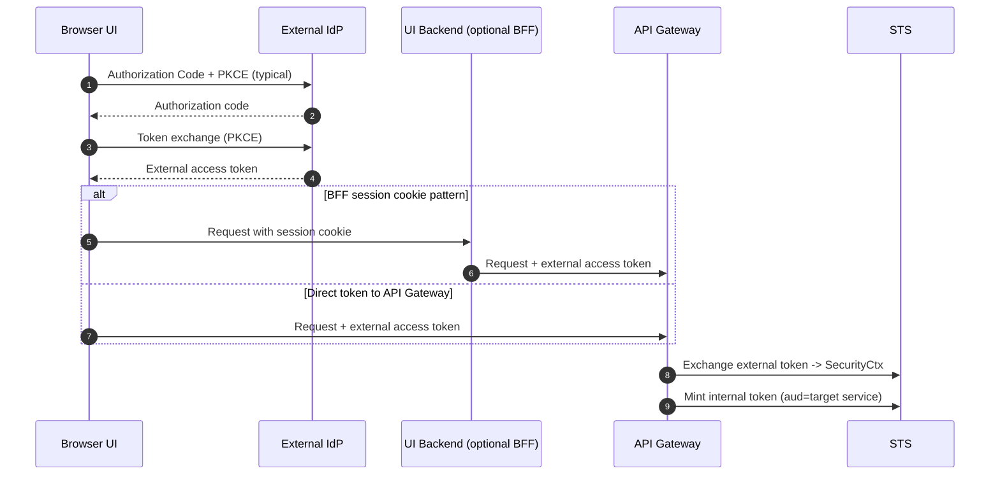
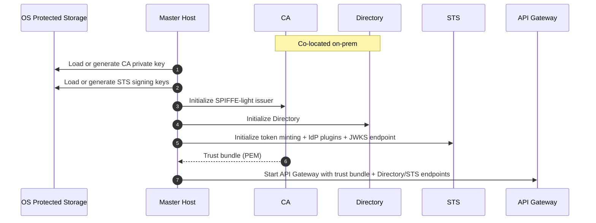
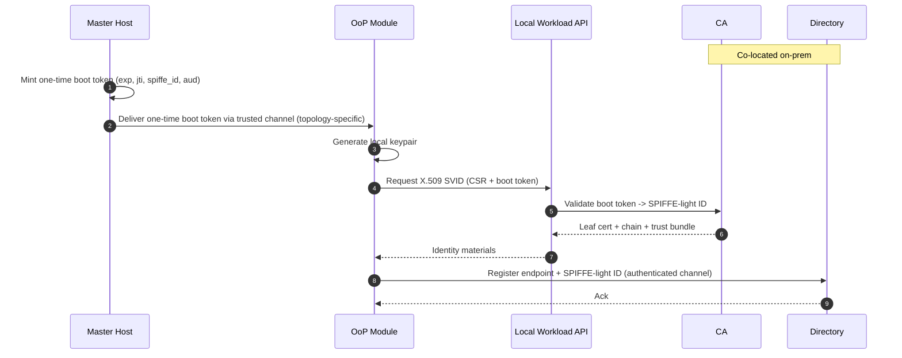
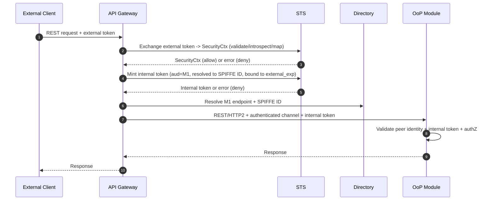
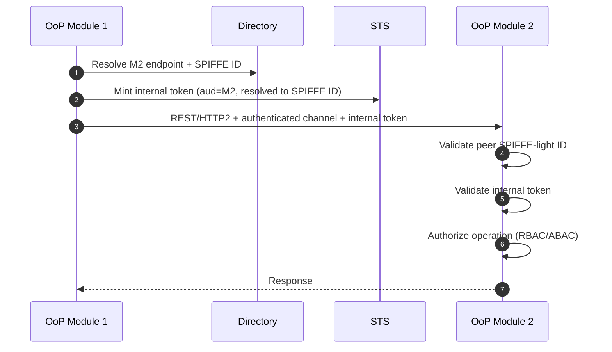
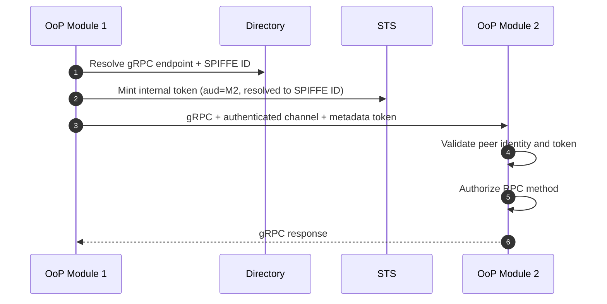

# Design Overview: Zero-Trust OoP Modules with SPIFFE-light and STS

This document describes the security and communication architecture for a modular Rust system with:

* On-prem targets: Windows, macOS.
* Cloud target: Kubernetes (Linux).
* OoP (out-of-process) modules communicating via REST (first-class, over HTTP/2) and optionally gRPC.
* Zero-trust east-west traffic using mTLS (workload identity) plus a short-lived internal token (delegation and canonical security context).
* External clients arriving with tokens issued by their own Identity Providers (IdP).

The design explicitly separates control plane and data plane responsibilities.

SPIFFE is used as a standard format for workload identity (naming, issuance, and validation), not as a new security concept.

This design is aligned with Zero Trust principles in NIST SP 800-207 (focus on identity, continuous verification, and removing network location trust). ([NIST Publications][2])

---

## Non-goals

* Replacing external IdPs or implementing login flows.
* Providing a service mesh (but the design stays compatible with one).
* Building full SPIRE attestation on-prem (this is why SPIFFE-light exists), but we keep a migration path.

---

## Glossary

* **SPIFFE**: a set of standards for workload identity across heterogeneous environments (naming via SPIFFE IDs, issuance/rotation of SVIDs, and a Workload API contract).
* **SPIFFE ID**: URI identifier for a workload identity (`spiffe://<trust-domain>/<path>`). ([SpiFFE][3])
* **SVID**: SPIFFE Verifiable Identity Document. In practice here: X.509 certificate used for mTLS. ([SpiFFE][4])
* **Trust domain**: administrative boundary for identities and trust bundles. ([SpiFFE][3])
* **SPIFFE-light**: SPIFFE-shaped identities + Workload API abstraction without running SPIRE on-prem.
* **External IdP**: an external Identity Provider that performs end-user login and issues external access tokens. External IdP behavior and session management are out of scope.
* **STS**: internal Security Token Service that validates and normalizes external access tokens into canonical `SecurityCtx` and mints short-lived internal tokens for services.
* **Directory**: service discovery plus expected service identity (SPIFFE ID) for endpoints.
* **Control plane**: issues identities, policies, keys; authoritative state.
* **Data plane**: executes per-request enforcement; stateless and replaceable.

---

## STS vs External IdP (Clarification)

STS is not an Identity Provider (IdP). It exists inside this system boundary and is used to:

* validate external access tokens presented at the boundary,
* normalize external identity into a canonical `SecurityCtx`, and
* mint short-lived internal tokens scoped to internal audiences.

STS MUST NOT implement or assume responsibility for end-user login flows, refresh tokens, user sessions, browser cookies, or UI.

External tokens are minted by external IdPs (out of scope). Boot tokens are minted by the control plane (in scope).

---

## Threat model and security goals

### Assumptions and failure cases

1. Network is hostile:

   * traffic can be observed, modified, replayed.
   * DNS/IP cannot be trusted for identity.

2. Any OoP module can be compromised:

   * a module may attempt to impersonate another module.
   * a compromised module may try lateral movement.

3. External tokens are untrusted inside:

   * internal services must not accept arbitrary external IdP tokens.

4. Directory is a high-value target:

   * poisoning Directory means routing to an attacker.

5. Keys leak eventually:

   * we must support rotation and fast blast-radius reduction.

### Security goals

* Every request is authenticated and authorized, regardless of network location (Zero Trust). ([NIST Publications][2])
* Workload identity is cryptographic (mTLS with SPIFFE-shaped IDs), not IP/DNS. ([SpiFFE][4])
* Canonical internal security context is consistent across protocols.
* Lateral movement is constrained by:

  * identity-bound mTLS, and
  * audience-bound internal tokens, and
  * explicit authorization policy.
* Operational safety:

  * rotation is routine, not a crisis.
  * failure modes are defined (STS down, Directory down, CA rotation, etc).

---

## Control Plane vs Data Plane

### Control Plane (decides and configures)

The control plane is authoritative and stateful. It owns identity, policy, and lifecycle decisions.

Components:

* Master Host / Module Orchestrator
* STS (Security Token Service)
* CA / SPIFFE-light issuer (workload certificates, trust bundle)
* Directory (service discovery and expected service identities)
* Configuration and key persistence (protected storage, secrets)

Responsibilities:

* External identity normalization
* Policy evaluation (tenants, access policies, entitlements)
* Internal token minting
* Workload identity issuance (certificates)
* Trust bundle and key rotation
* Module lifecycle and discovery

On-prem note:
For on-prem deployments, CA + Directory + STS may be implemented together inside the Module Orchestrator to reduce footprint. These remain logically separate control-plane responsibilities.

On-prem practicality note (required):
The recommended default on-prem deployment SHOULD run control plane components co-located in a single control-plane process (logical separation only). Control plane components MAY be physically split into multiple processes only when needed for scaling or hardening. If physically split, all inter-component communication MUST use authenticated and integrity-protected transports appropriate to the topology (mTLS for network paths, or OS-authenticated local IPC for same-host paths).

---

### Data Plane (executes per request)

The data plane is stateless, horizontally scalable, and replaceable.

Components:

* API Gateway (`api_gateway`)
* OoP modules (REST/gRPC servers and clients)
* mTLS connections
* REST and gRPC request handling

Responsibilities:

* Request routing and proxying
* Cryptographic validation (TLS, token signatures)
* Rate limits and quotas
* Request/response transformation
* Observability (metrics, logs, tracing)

Important:
API Gateway (`api_gateway`) is intentionally a pure data plane component. It enforces decisions produced by the control plane but does not own identity, policy, or lifecycle state.

---

## Deployment topologies and trust boundaries

This design supports multiple deployment topologies. The trust boundary and allowed transports depend on whether components share a host.

### On-prem: same host mode

Definition:

* Control plane and modules run on the same OS host.

Requirements:

* East-west calls between modules SHOULD use mTLS when routed over the network stack.
* For same-host process boundaries, local IPC transports (Unix domain sockets, Windows named pipes) MAY be used as an alternative to mTLS if the server enforces OS-level ACLs and verifies peer credentials. The resulting caller identity MUST still be represented as a SPIFFE ID for authorization, auditing, and Directory policy.

### On-prem: multi-host mode

Definition:

* Control plane and/or modules run on different hosts over a network.

Requirements:

* All inter-process communication that crosses hosts MUST use mTLS with SPIFFE-shaped identities.

### Kubernetes: pod-to-pod mode

Definition:

* Control plane and modules run as pods in a Kubernetes cluster.

Requirements:

* All pod-to-pod (and node-to-node) communication MUST use mTLS with SPIFFE-shaped identities.
* Bootstrap and enrollment MUST follow the Kubernetes bootstrapping requirements in this spec.

## Why this design works

1. Identity is separated from location
   Services are discovered via Directory. Trust is established cryptographically (mTLS + tokens), not via IPs or DNS.

2. External token formats stop at the edge
   Only API Gateway (`api_gateway`) and STS understand external IdP tokens. Internal services see a single canonical security model.

3. Zero-trust east-west without a gateway bottleneck
   Module-to-module traffic goes direct, but every request is authenticated and authorized.

4. Uses established primitives

   * SPIFFE/SVID: workload identity via certificates ([SpiFFE][4])
   * STS: short-lived, scoped credentials
   * Boundary authentication with internal authorization

---

## Continuous monitoring, audit, and SIEM/SOAR integration (Required)

Zero Trust requires continuous verification and strong auditability, not just best-effort logs.
This section defines the minimum telemetry that the data plane and control plane MUST emit.

### Audit event model (minimum)

Every enforcement point (API Gateway (`api_gateway`), each module server interceptor, STS, Directory) MUST emit structured audit events with:

* `timestamp`
* `trace_id` / `correlation_id`
* `tenant_id` (`tid`)
* `actor_subject` (`sub`) and `actor_type`
* `peer_spiffe_id` (from mTLS, or from OS-authenticated local IPC mapping) for internal calls
* `caller_spiffe_id` (token claim)
* `aud` (intended callee identity)
* `operation` (HTTP method + route template, or gRPC full method)
* `decision` (`allow|deny`)
* `reason_code` (stable enum; do not rely on free-text)
* `token_kid` and optional `jti` (careful with PII and log volume)

### Required metrics (examples)

* AuthN/AuthZ decisions: allow/deny counters by `reason_code`, `service_id`, `tenant_id`.
* Token minting: STS mint requests, cache hit ratio, failures by reason.
* External validation: JWKS refresh failures, introspection latency/errors.
* Directory: resolve latency/errors, cache hit ratio.
* mTLS failures: trust bundle mismatch, peer identity mismatch.

### SIEM/SOAR export (vendor-agnostic)

Audit events MUST be exportable to a central system (SIEM) and optionally actionable via SOAR.
Transport can be filebeat/agent, OTLP, syslog, or HTTP collector, but the schema MUST remain stable.

### Detection and alerting (minimum)

The platform SHOULD alert on:

* Spike in `deny` rate per service/tenant (possible misconfig or attack).
* Repeated failures for `caller_spiffe_id != peer_spiffe_id` (possible impersonation/lateral movement).
* High rate of unknown/rotated `kid` (key mismatch or attack).
* Introspection errors/timeouts above threshold (IdP outage or DDoS).
* Directory resolution anomalies (unexpected endpoint changes, frequent re-registrations).

---

## References: SPIFFE / SVID / SPIFFE-light

* SPIFFE overview ([SpiFFE][4])
* SPIFFE concepts: SPIFFE ID format, trust domain, Workload API ([SpiFFE][3])

In this design, SPIFFE-light ID means a SPIFFE-shaped workload identity without requiring SPIRE:

`spiffe://<trust-domain>/workload/<module-name>`

* It is an identity, not a DNS name.
* It is never resolved via DNS.
* Resolution is done via Directory.

SPIFFE provides standardization for workload identity across environments, not a new security model. This design uses SPIFFE IDs and SVIDs as interoperable identity primitives.

SPIRE remains a future upgrade path. ([SpiFFE][5])

---

## Roles and Responsibilities

### Master Host (on-prem)

Control plane entry point:

* Hosts STS, CA (SPIFFE-light), Directory
* Starts and configures API Gateway (`api_gateway`)
* Manages protected storage for long-lived keys

#### Key storage (on-prem) (Required)

Long-lived secrets (CA private key, STS signing keys, and any bootstrap/sealing keys) MUST be stored in **OS protected storage** and never in plaintext files.

Implementation note (TBD per platform):

* Windows: DPAPI / CNG / TPM-backed key storage
* macOS: Keychain / Secure Enclave where available
* Linux on-prem: OS keyring or a local HSM/TPM integration

TODO: Specify concrete APIs and threat model per supported OS (backup/restore, key export policy, operator access).

On-prem simplification:

* CA and Directory may be implemented together to reduce footprint.

### Kubernetes (cloud)

Same logical roles, different primitives:

* CA may be internal or cluster-managed (e.g. cert-manager).
* Keys and bundles stored in Secrets or external KMS.
* Directory and STS remain unchanged conceptually.

### STS with IdP plugins

STS contains pluggable adapters per external IdP:

* OIDC JWT
* OAuth2 introspection
* Custom enterprise IdPs

Each plugin:

* Maps external claims into canonical `SecurityCtx`
* Applies tenant and access policies
* Mints short-lived, audience-bound internal tokens

STS is strictly control plane:

* No login flows
* No refresh tokens
* No user sessions

### STS API sketch (Draft)

The following STS APIs are recommended to make responsibilities explicit and implementation testable.

#### `POST /v1/exchange` (external token → `SecurityCtx`) (Draft)

Called by: API Gateway (`api_gateway`) only (boundary). Auth: mTLS (SPIFFE ID) for network paths, or OS-authenticated local IPC for same host paths.

Request (draft):

* `external_token`: bearer token string
* `requested_audience`: logical service id or SPIFFE ID (optional; can be used for policy)
* `trace_id` (optional; if not provided, STS generates one)

Response (draft):

* `security_ctx`: canonical `SecurityCtx` (or subset)
* `external_exp`: expiry timestamp observed/validated by STS (used to bound internal TTL)
* `decision`: allow/deny + reason code (optional if deny represented as error)

Errors (draft):

* `EXT_TOKEN_INVALID` / `EXT_TOKEN_EXPIRED` / `EXT_TOKEN_REVOKED`
* `STS_UNAVAILABLE`

TODO: Define exact JSON schema and stable error codes for this endpoint.

#### `POST /v1/mint` (mint internal token for `aud`) (Draft)

Called by: API Gateway (`api_gateway`) and internal modules. Auth: mTLS (SPIFFE ID) for network paths, or OS-authenticated local IPC for same host paths.

Request (draft):

* `aud`: callee logical service id or SPIFFE ID (input; STS resolves to callee SPIFFE ID)
* `security_ctx`: canonical `SecurityCtx` (boundary: API Gateway (`api_gateway`) only)
* `external_exp` (optional; if provided, STS bounds TTL; if absent, STS uses policy_max_ttl only)

STS MUST set the minted internal token `aud` claim to the callee SPIFFE ID (resolved from the request `aud` input).

Boundary mint vs internal mint:

* Boundary (API Gateway (`api_gateway`)): MUST call `/v1/mint` using an authenticated channel (mTLS for network paths, or OS-authenticated local IPC for same host paths) and `security_ctx` (derived from `/v1/exchange`), without requiring an existing internal token.
* Internal modules: MUST call `/v1/mint` using an authenticated channel (mTLS for network paths, or OS-authenticated local IPC for same host paths) AND an existing internal token in `Authorization: Bearer <internal-token>` as the context handle, and MUST NOT submit `security_ctx`.

Internal (east-west) mint rule:

* Internal modules MUST present an existing internal token as `Authorization: Bearer <internal-token>` when calling `/v1/mint`.
* Internal modules MUST NOT submit `security_ctx`.
* STS MUST validate the presented internal token and MUST verify the presented internal token `caller_spiffe_id` matches the STS-observed `peer_spiffe_id` from the authenticated channel.
* STS MUST derive mint input (`sub`, `tid`, and `ctx`) from the presented internal token.

Response (draft):

* `token`: internal bearer token
* `exp`: expiry timestamp

Errors (draft):

* `NOT_AUTHZ` (caller not allowed to mint for this `aud`)
* `EXT_TOKEN_INVALID` (if mint is derived from an invalid external context)
* `STS_UNAVAILABLE`

### External IdP token handling (Required)

External identity is accepted **only at the boundary** (API Gateway (`api_gateway`)) and normalized by STS plugins.
Internal services and modules MUST NOT validate or accept external IdP tokens directly.

Normative split of responsibilities:

* API Gateway (`api_gateway`) is the boundary enforcement point (PEP): it accepts the external access token and delegates **all** token validation/introspection/claim mapping to STS.
* STS is the boundary decision + issuer component: it performs external validation + normalization and returns canonical `SecurityCtx` and/or minted internal tokens.

API Gateway (`api_gateway`) MAY perform only cheap syntactic checks (presence, size limits, basic format) for early rejection, but MUST NOT interpret external claims for authorization.

#### Supported external token types

API Gateway (`api_gateway`) and STS plugins MUST support the following (your environment may enable a subset):

1. **OIDC/OAuth2 access token as JWT** (signed): offline validation using IdP JWKS.
2. **OAuth2 access token as opaque string**: online validation via IdP **introspection**.

#### Refresh tokens (explicitly out of scope)

This system MUST NOT accept, store, forward, or manage refresh tokens.
Refresh token lifecycle (storage, rotation, theft protection) is owned by the external client and/or external IdP SDK/agent.

#### What happens when the external access token expires/revokes (Required)

If the external access token expires or is revoked, the system cannot self-heal inside the boundary because external refresh is out of scope.

Normative behavior:

* API Gateway (`api_gateway`) MUST reject requests with an expired/revoked external token (fail closed).
* STS MUST refuse to mint internal tokens derived from an expired/revoked external token.
* Internal modules MUST NOT attempt to contact the external IdP and MUST NOT attempt to refresh external tokens.

Expected client behavior (informative):

* The external client obtains a fresh access token from its IdP (typically via refresh held by the client/SDK).
* The client retries the request with the new access token; API Gateway (`api_gateway`) normalizes it and mints new internal tokens as needed.

TBD (design choice for future iterations):

* Long-running/background operations that outlive a single external access token need an explicit delegation model (e.g., job tokens, workload principals, or re-auth at checkpoints). This is intentionally not specified here.

#### JWT validation requirements (normative)

When the external token is a JWT, the STS plugin (invoked by API Gateway (`api_gateway`)) MUST:

* Verify signature against IdP JWKS (`kid` resolution, bounded cache).
* Enforce an allow-list of acceptable algorithms (reject `none` and unexpected `alg`).
* Verify standard claims:
  * `iss` matches configured IdP issuer.
  * `aud` contains the expected audience for this boundary (do not accept any audience).
  * `exp` is in the future (with bounded clock skew).
  * `nbf` (if present) is satisfied (with bounded clock skew).
  * `iat` is not unreasonably far in the future.
* Extract canonical subject and tenant inputs from claims (see mapping below).

If JWT revocation checks are available (introspection for JWT, revocation events, or a revoked-`jti` feed), the plugin SHOULD use them.
If not available, revocation is bounded by `exp` (this limitation MUST be documented operationally).

#### Introspection requirements for opaque tokens (normative)

When the external token is opaque, STS plugin MUST validate it via IdP introspection:

* Use HTTPS with strict TLS validation.
* Apply short timeouts and bounded retries (avoid IdP outages turning into a cascade).
* Treat introspection unavailable as **fail-closed** for new requests that cannot be satisfied from a bounded cache.
* Cache positive introspection results for a short duration, bounded by the token’s remaining lifetime.
* Use `active=false` (or equivalent) as a hard deny.

#### Claim mapping: external token → canonical `SecurityCtx` (minimum)

STS plugin MUST produce a canonical `SecurityCtx` using a deterministic mapping. Example minimum mapping:

| `SecurityCtx` field | Source (JWT claim / introspection) | Notes |
|---|---|---|
| `tenant_id` | `tid` / `tenant` / custom claim | Required. If missing, deny. If ambiguous, deny. |
| `subject` | `sub` | Stable subject id. If missing, deny. |
| `actor_type` | constant (`user`) | External callers are modeled as `user` by default. |
| `roles` | `roles` / `groups` / `scp` | Normalize to a stable internal namespace; avoid raw IdP group names leaking across tenants. |
| `resource_scope` | `scope` / custom | Optional; use only if you enforce resource-level scoping. |
| `trace` fields | generated at boundary | Correlation ids for auditability. |

Mapping rules:

* Reject tokens that cannot be mapped to a unique `tenant_id`.
* Normalize roles/entitlements to an internal namespace (`tenant:<tid>:role:<name>` or similar) to avoid collisions across IdPs.
* Do not propagate arbitrary external claims into internal tokens; only propagate the minimal canonicalized set used for authZ.

---

## Why internal tokens exist in addition to mTLS

The design uses both mTLS and internal tokens because they mitigate different threats:

* mTLS authenticates the workload and channel identity (which workload is calling, and that the channel is protected).
* Internal token carries end-user or tenant delegation (`SecurityCtx`) end-to-end across hops, without relying on external token formats inside the boundary.
* Internal token provides downscoping (strict `aud`, short TTL), consistent authorization inputs across protocols, and better audit correlation (`tid`, `sub`, `jti`, `caller_spiffe_id`).
* Internal tokens enable policy changes and revocation checks via STS without propagating external tokens internally.
* This reduces blast radius if a module is compromised, because compromised modules cannot mint broader tokens, and stolen tokens are scoped and short-lived.

## Internal token format and rules (Required)

Internal token is minted by STS and consumed by modules and API Gateway (`api_gateway`).

### Required claims

* `iss`: STS issuer id
* `sub`: canonical subject (`ctx.subject`)
* `caller_spiffe_id`: caller workload SPIFFE ID observed at mint time
* `aud`: callee SPIFFE ID
* `exp`: short TTL (minutes, not hours)
* `iat`: issued-at
* `jti`: unique id (supports replay detection if you add a cache)
* `tid`: effective tenant id for this request (Required)
* `scp` or `roles`: authorization inputs
* `ctx` (recommended): canonicalized SecurityCtx payload (or a minimal subset required for authZ)

Notes:

* `caller_spiffe_id` is only for binding the token to transport identity and audit clarity, not an alternative identity source.
* `tid` MUST equal `ctx.tenant_id`; mismatch is an invalid token.
* If the token includes `ctx`, then `ctx` MUST include at least `{ tenant_id, subject, actor_type }`.
* If the token does NOT include `ctx`, services MUST reconstruct a minimal SecurityCtx from other claims (at least `tid`, `sub`, and roles/scp, plus a deterministic actor_type) sufficient for authorization and auditing.
* If you embed `ctx`, you may optionally include `ctx_hash` for debugging or integrity checks.
* Token format may be JWT or PASETO, but requirements above remain the same.

UNDER DESIGN (scope expansion):

* `ctx.scope` may be expanded from `tid` via a Tenant Resolver (e.g., tenant hierarchy) to support server-side filtering of resources (tasks, etc.).
* TODO: Decide representation: explicit lists vs compressed scope vs `scope_ref`/`scope_hash` with TTL and a resolver cache.

### Internal token lifetime and SecurityCtx freshness (Required)

Rule: internal tokens are **ephemeral** and MUST be minted with a lifetime that is never longer than the remaining validity of the external token (when an external token exists).

Normative TTL rule:

* Let `policy_max_ttl` be a small value (recommended 1–5 minutes).
* Let `external_exp` be the validated external access token expiry (from JWT `exp` or introspection response).
* Let `skew` be a bounded clock skew (recommended 30–120 seconds).

Then:

* `internal_exp = min(now + policy_max_ttl, external_exp - skew)`

If `external_exp - skew <= now`, STS MUST NOT mint an internal token.

SecurityCtx freshness model:

* `SecurityCtx` MUST be reconstructed from the **internal** token on every hop (request-scoped).
* Updating SecurityCtx means **minting a new internal token** (which triggers re-evaluation of current external token status and policies/entitlements in STS).

Clarification (runtime):

* Inside the trust boundary, services/modules **do not** validate external tokens and **do not** call the external IdP.
* `SecurityCtx` expires when the **internal** token expires; on the next outbound call, the client middleware must mint a fresh internal token from STS.
* If the external token is expired or revoked, STS refuses to mint, so the internal context cannot be refreshed and requests fail closed.

### External token revocation propagation (Required when available)

If the IdP supports revocation checks (opaque token introspection, JWT introspection, revocation events, or a revoked-`jti` feed), STS plugin MUST treat a revoked/inactive external token as **hard deny** and MUST NOT mint internal tokens.

Operational note:

* For opaque tokens, revocation is enforced via introspection (`active=false`).
* For JWT tokens, near real-time revocation requires an IdP mechanism beyond offline signature validation. If such a mechanism is not available, revocation is bounded by JWT `exp`.

### STS caller authentication (Required)

STS accepts token-minting requests only via an authenticated channel:

* STS MUST require an authenticated channel (mTLS for network paths, or OS-authenticated local IPC for same host paths).
* STS MUST identify caller by SPIFFE ID from peer certificate URI SAN (mTLS) or from OS-authenticated local IPC mapping (same host).
* STS MUST enforce policy defining which callers may mint tokens for which audiences (`aud`).

### Token binding to mTLS (Recommended)

To reduce token theft/forwarding risk, bind token to the mTLS channel:

* Include a confirmation claim derived from the client certificate public key (or its hash).
* Server validates that presented client cert matches token binding.

If the client certificate rotates, previously minted bound tokens become invalid and clients must mint new tokens.

If you do not implement binding, compensate with:

* very short TTL,
* strict `aud`,
* strict peer SPIFFE ID checks,
* and aggressive rotation.

### Key distribution

* STS publishes a JWKS-like key set for verification (by `kid`).
* Data plane caches keys with bounded lifetime.
* Rotation must be supported without downtime (old and new keys overlap for a grace window).

---

## East-west request validation (Required)

Every internal request uses an authenticated channel identity (mTLS, or OS-authenticated local IPC in same host mode) and an internal token.

Same-host transport note:
In on-prem same host mode, implementations MAY use OS-authenticated local IPC (Unix domain sockets, Windows named pipes) for inter-process calls instead of mTLS. When local IPC is used:

* The server MUST verify OS-level peer credentials.
* The caller identity MUST be mapped to a SPIFFE ID.
* Authorization and audit MUST use SPIFFE ID semantics exactly as with mTLS.

Local IPC is an alternative transport, not an alternative security model. If the communication path can be reached over the network, mTLS MUST be used.

### Server-side checks (normative)

For every inbound request (REST or gRPC), server interceptor MUST:

1. Validate peer mTLS identity:

   * validate chain to trust bundle
   * extract `peer_spiffe_id` from URI SAN
   * determine `server_spiffe_id` from local server certificate

   If local IPC is used instead of mTLS, the server MUST perform an equivalent OS-level peer credential verification and MUST produce `peer_spiffe_id` consistent with the expected SPIFFE ID mapping.

2. Validate internal token:

   * verify signature via `kid` (on unknown `kid`, verifier MUST attempt a single bounded JWKS refresh; if still unknown, deny with `BAD_TOKEN_SIG`)
   * verify `iss`, `aud`, `exp`, `iat`
   * verify `aud` equals `server_spiffe_id`

3. Bind token identity to mTLS identity:

   * verify that the token claim `caller_spiffe_id` equals `peer_spiffe_id`

 Delegation note:

 * Delegation is a future extension.
 * `delegation_enabled` MUST be false by default and MUST NOT be enabled unless the delegation extension is implemented and specified.
 * Unless delegation is implemented and specified, the check in (3) MUST be strict equality: `caller_spiffe_id == peer_spiffe_id`.

4. If token binding is enabled:

   * verify token confirmation claim matches presented client certificate

5. Reconstruct canonical `SecurityCtx` from token and store in task-local for request scope.

6. Enforce tenant invariant:

   * `tid` MUST equal `ctx.tenant_id`

 Fail-closed rule:

* Missing or invalid token or invalid mTLS MUST reject the request.

### Reference pseudocode: inbound interceptor (informative)

```text
fn handle_inbound(request):
  peer_cert = tls.peer_certificate()
  peer_spiffe_id = extract_uri_san_spiffe_id(peer_cert)
  assert(peer_spiffe_id is not None) else deny("NO_PEER_SPIFFE_ID")

  server_spiffe_id = tls.local_spiffe_id()
  assert(server_spiffe_id is not None) else deny("BAD_MTLS_CHAIN")

  token = parse_bearer_token(request.headers["Authorization"])
  claims = verify_internal_token(token, jwks_cache)
  assert(claims.iss == STS_ISSUER) else deny("BAD_ISS_OR_AUD")
  assert(claims.aud == server_spiffe_id) else deny("BAD_ISS_OR_AUD")
  assert(now < claims.exp) else deny("TOKEN_EXPIRED")

  // bind token identity to channel identity
  if delegation_enabled:
    assert(claims.caller_spiffe_id == peer_spiffe_id or is_allowed_delegate(peer_spiffe_id, claims.caller_spiffe_id)) else deny("CALLER_SPIFFE_MISMATCH")
  else:
    assert(claims.caller_spiffe_id == peer_spiffe_id) else deny("CALLER_SPIFFE_MISMATCH")

  if token_binding_enabled:
    assert(verify_confirmation_claim(claims, peer_cert)) else deny("TOKEN_BINDING_FAIL")

  if claims.ctx is present:
    ctx = reconstruct_security_ctx(claims.ctx)
  else:
    ctx = reconstruct_minimal_security_ctx_from_claims(claims)  
  assert(ctx.tenant_id is not None) else deny("NO_TENANT")

  assert(claims.tid == ctx.tenant_id) else deny("TID_CTX_MISMATCH")

  // module-specific authorization
  assert(authorize(ctx, request.operation, request.resource)) else deny("NOT_AUTHZ")

  return next_handler(request, ctx)
```

---

## Authorization model (authZ), not optional

Authentication establishes who is calling. Authorization determines whether the operation is permitted.

### Where policy lives

* Policy evaluation is a control plane responsibility (STS or a dedicated Policy Engine).
* Data plane enforces the decision per request using internal token contents and `SecurityCtx`.

Role clarity (normative):

* STS and/or a dedicated Policy Engine is the policy decision point (PDP) for boundary normalization and token mint authorization.
* API Gateway (`api_gateway`) and module interceptors are policy enforcement points (PEPs): they enforce allow/deny outcomes and per-operation authorization.

### Hybrid authorization semantics (RBAC + entitlements) (Required)

This design assumes a hybrid model:

* **RBAC** for coarse access (which endpoints/operations are even possible).
* **Entitlements / attributes** for constraints (tenant isolation, resource scoping, risk/device posture, feature flags).

#### Entitlements format (recommended)

Entitlements SHOULD be represented in a stable, namespaced format to avoid collisions across IdPs and tenants.
Examples:

* String permissions: `perm:<namespace>:<name>` (e.g. `perm:billing:invoice.read`)
* Tenant-namespaced permissions: `tenant:<tid>:perm:<namespace>:<name>`
* Structured (if you need parameters): `{"perm":"billing:invoice.read","constraints":{"region":"eu","risk_max":30}}`

Regardless of representation, the **evaluation semantics** must be deterministic and documented.

#### Conflict resolution and evaluation order (normative)

To avoid ambiguity, the system MUST define a single conflict strategy. Recommended baseline:

* **Deny-by-default**: if a request cannot be matched to an explicit allow rule, deny.
* **Deny-overrides**: explicit denies take precedence over allows.
* **Most-specific-wins**: if multiple rules match, the rule with the most specific scope (tenant+resource+operation) wins, unless a deny applies.

Evaluation inputs per request:

* Request metadata: operation (route/RPC), method, target resource ids, requested tenant.
* Transport identity: `peer_spiffe_id` (from mTLS).
* Token identity/context: `SecurityCtx` from internal token (`tid`, `subject`, `roles`, `entitlements`, `resource_scope`, optional `risk/device`).

#### Tenant isolation (required invariant)

Tenant isolation MUST be enforced at multiple layers:

* API Gateway (`api_gateway`) MUST prevent cross-tenant routing based on resolved `tenant_id`.
* Every module MUST validate that any resource access is within `SecurityCtx.tenant_id` (and/or `resource_scope`) before performing the operation.

#### Context-aware decisions (optional, but supported)

If you incorporate signals such as device posture, location, or risk score, they MUST:

* be provided as explicit fields in `SecurityCtx` (or as entitlements with constraints),
* be evaluated deterministically by rules,
* be auditable (see logging section).

### Examples (informative)

Example 1: RBAC + entitlement on a REST route

* Request: `GET /v1/invoices/{id}`
* Required role: `role:billing.reader`
* Required entitlement: `perm:billing:invoice.read`
* Required scope: `resource_scope` must include `invoice:{id}` OR `tenant:{tid}:invoices:*`

Example 2: deny-overrides (incident response)

* If STS or data plane maintains a temporary denylist for `subject` or `jti`, any match MUST deny even if roles/entitlements allow.

### Minimal viable model

Pick one and document it clearly in code and schemas:

1. RBAC:

   * roles in token
   * mapping role -> allowed operations in module

2. ABAC:

   * attributes in token (`tenant_id`, `resource_scope`, `entitlements`)
   * policy engine outputs allow/deny and optional constraints

3. Hybrid:

   * roles for coarse access
   * ABAC constraints for tenant/resource scoping

### Required enforcement points

* API Gateway (`api_gateway`) must enforce:

  * tenant boundary (no cross-tenant routing),
  * global quotas/rate limits,
  * coarse endpoint access if needed.

* Every module must enforce:

  * operation-level authorization (method, route, RPC),
  * resource-level scope if applicable (tenant + resource ids),
  * denial-by-default for unknown operations.

Rule: a valid token is not sufficient for authorization.

---

## SDK and Middleware Responsibilities (Required)

### Client-side interceptors (outbound calls)

1. gRPC client interceptor

   * Reads task-local `SecurityCtx`
   * Requests an internal token from STS (audience = callee) using the current request’s internal token as the context handle
   * Attaches `Authorization: Bearer <internal-token>` as gRPC metadata

2. REST client middleware

   * Reads task-local `SecurityCtx`
   * Requests an internal token from STS (audience = callee) using the current request’s internal token as the context handle
   * Attaches `Authorization: Bearer <internal-token>` as HTTP header

Token minting should be cached per `(aud, ctx_fingerprint)` until near expiry to avoid hammering STS.

TODO: Specify concrete caching parameters:

* `refresh_before_expiry`: e.g. refresh when remaining TTL < 20% or < 30s
* jitter: randomize refresh to avoid thundering herd
* max entries per process and eviction policy
* max STS QPS per module + backoff behavior
* behavior when STS is intermittently unavailable (use cached token until near expiry, then fail closed)

### Server-side interceptors (inbound calls)

3. REST and gRPC server interceptors

   * Validate peer mTLS identity (trust bundle, extract peer SPIFFE ID)
   * Validate internal token (`kid`, signature, `iss`, `aud`, `exp`, `iat`)
   * Enforce token claim `caller_spiffe_id` equals peer SPIFFE ID (strict equality unless delegation is implemented and specified)
   * Apply token binding checks if enabled
   * Reconstruct canonical `SecurityCtx`
   * Store `SecurityCtx` in task-local storage for request scope

### Boundary rule

4. External tokens are accepted only at the boundary

   * External tokens are validated only in API Gateway (`api_gateway`)
   * Internal services never accept external IdP tokens
   * Everything inside uses canonical internal tokens

---

## Directory requirements (security-critical)

Directory is not just service discovery. It is an authorization input and must be protected accordingly.

If `allowed_callers` is present for a service, it MUST be treated as an authorization input, not metadata. Directory poisoning or misregistration affects authorization decisions and routing.

### Directory data model (minimum)

For each service endpoint:

* `service_id` (logical name)
* `spiffe_id` (expected identity)
* `owner_spiffe_id` (control plane provisioned owner identity)
* `endpoints` (host:port, protocol)
* `status` and `last_heartbeat` (optional but practical)
* `allowed_callers` (optional, strongly recommended)

  * list of caller SPIFFE IDs or groups allowed to call this service

Enforcement (normative):

* Resolve-time: Directory MUST authenticate the resolver and MUST enforce `allowed_callers` by denying or filtering results for callers not in `allowed_callers`.
* Call-time: the callee MUST enforce `allowed_callers` by checking `peer_spiffe_id` against the allowed set for its `service_id` (from a cached view of Directory policy or local configuration).

### Directory write access (Required)

Only authenticated modules may register:

* module registration MUST be authenticated using the issued identity (mTLS for network paths, or OS-authenticated local IPC for same host paths).
* registration MUST be restricted so a module can register only what it is allowed to register (service id constraints).
* Directory MUST bind the registered entry’s `spiffe_id` to the registering module’s caller identity.

Write authority (normative):

* `owner_spiffe_id` and `allowed_callers` MUST be provisioned by control plane configuration (or operator action) and MUST NOT be set or overridden by module self-registration.

Ownership rule:

* `owner_spiffe_id` MUST be provisioned by control plane configuration (or operator action) and MUST NOT be implicitly assigned by first registration in production.
* In development, Directory MAY support implicit ownership assignment only when explicitly enabled by configuration.

### Directory read access

* data plane and modules may read, but:

  * Directory access MUST use mTLS for network paths, and MAY use OS-authenticated local IPC for same host paths
  * Directory SPIFFE ID SHOULD be pinned/verified by clients

### Directory API sketch (Draft)

TODO: Specify concrete API endpoints and a stable schema. Recommended minimum:

* `GET /v1/resolve?service_id=<id>` → `{ service_id, spiffe_id, endpoints[], ttl }`
* `POST /v1/register` (authenticated channel only) → idempotent replace of the caller’s registration for `service_id` (Directory binds `spiffe_id` from caller identity) with `{ service_id, endpoints[], metadata }`
* `POST /v1/revoke` (authenticated channel only) → revoke a registration. Directory MUST allow a module to revoke its own registration for its `service_id`; `owner_spiffe_id` and operators MUST be able to revoke registrations.

Required client behavior:

* Pin `Directory` SPIFFE ID.
* Cache resolve results for `ttl` with jitter; fail closed when cache is missing/expired.

TODO: Define anti-poisoning controls: who can register which `service_id`, rate limits, replay protection, and how to revoke registrations in incident response.

---

## Bootstrap and Enrollment: Boot Token (Required)

### Definition and purpose

A boot token is a short-lived, single-use credential minted by the control plane and delivered to a specific module instance for initial enrollment only.

Purpose:

* A boot token MUST be accepted only for initial SVID issuance via the Workload API.
* A boot token MUST NOT be used for routine authentication, authorization, or service-to-service requests.

External tokens are minted by external IdPs (out of scope). Boot tokens are minted by the control plane (in scope).

### Boot token properties (normative)

Boot tokens MUST be cryptographically verifiable (signed by a control-plane issuer) and MUST contain or be bound to:

* `exp`: short TTL (recommended minutes).
* Single-use semantics.
* `spiffe_id`: the intended SPIFFE ID for the enrolling module instance (or an unambiguous module instance identity that deterministically maps to the target `spiffe_id`).
* `aud`: the local Workload API (or the enrollment endpoint) as audience.
* `iss`: boot token issuer id (control plane).
* `jti`: unique identifier for replay protection.

### Issuance rules (normative)

* The control plane (Master Host / Module Orchestrator) MUST be the boot token issuer.
* Boot tokens MUST be minted only after an authorization decision that the target module instance is permitted to enroll for the target `spiffe_id`.
* Boot tokens MUST be minted per module instance launch or enrollment event and MUST NOT be long-lived.
* The control plane SHOULD NOT mint boot tokens in advance without an explicit enrollment intent.

### Delivery requirements by topology (normative)

1. Same host on-prem:

   * Boot tokens MUST be delivered over stdin or OS IPC with ACLs appropriate to the module process identity.
   * Environment variable delivery is discouraged and MUST be used only when the environment is not externally observable, is not persisted, and the process environment is restricted by OS access controls.

2. Kubernetes:

   * Bootstrapping MUST use Kubernetes primitives and MUST avoid long-lived plaintext secrets.
   * Preferred patterns include one of:
     * init container authenticates to the control plane using a projected service account token, requests a short-lived boot token, writes it to an in-memory `emptyDir` volume mounted into the application container, and the token MUST be removed after enrollment,
     * CSI Secret Store with rotation when an external secret provider is used, but long-lived plaintext boot tokens are prohibited.
   * Long-lived plaintext secrets (for example, a boot token stored as a static Kubernetes Secret without rotation) MUST NOT be used.
   * The application container MUST NOT start with a long-lived plaintext boot token.

3. Multi-host on-prem:

   * Boot token delivery over the network MUST NOT be unauthenticated.
   * Boot token delivery MUST require out-of-band trust establishment or host attestation (for example, operator-mediated secure transfer, TPM-backed attestation, or a pre-established authenticated channel).
   * Unauthenticated network delivery (HTTP, email, shared folders without access control) is forbidden.

### Validation rules at the Workload API (normative)

When a module requests an initial SVID using a boot token, the Workload API MUST:

* Verify boot token signature and issuer (`iss`).
* Verify expiry (`exp`) and reject expired tokens.
* Verify audience (`aud`) matches the Workload API enrollment audience.
* Verify the requested SPIFFE ID matches the boot token bound `spiffe_id`.
* Enforce single-use by maintaining a replay cache keyed by `jti` for at least the token lifetime, and reject replays.

### Audit logging requirements (normative)

The control plane and Workload API MUST emit audit events for boot token lifecycle with stable `reason_code` values, including at minimum:

* `BOOT_TOKEN_ISSUED`
* `BOOT_TOKEN_DELIVERED`
* `BOOT_TOKEN_REDEEMED`
* `BOOT_TOKEN_REPLAY_DENIED`
* `BOOT_TOKEN_INVALID`
* `BOOT_TOKEN_EXPIRED`

## Lifecycle management and rotation (Required)

### Workload certificates (SVIDs)

* short-lived leaf certificates (hours to 1 day)
* trust bundle distributed as first-class artifact ([SpiFFE][6])
* automated renewal before expiry

### Trust bundle rotation (Minimum)

* CA publishes versioned trust bundles.
* data plane and modules must support overlap:

  * accept both old and new CA during grace window
  * switch to new CA as default for new connections

### STS signing key rotation (Minimum)

* publish new keys in JWKS-like set
* overlap window: accept old signatures until max token TTL passes
* clients refresh keys periodically and on unknown `kid`

### Revocation strategy (Pragmatic on-prem)

Assume no OCSP unless explicitly implemented.

Practical approach:

* keep leaf TTL short
* rotate frequently
* if compromise is detected:

  * rotate CA and STS signing keys
  * invalidate Directory registrations
  * require module re-bootstrap

Optional incident-response deny-list:

* deny `caller_spiffe_id` (caller workload SPIFFE ID), `sub` (subject), or `jti` in data plane cache for bounded time
* use only for incident response, not as primary mechanism

---

## Incident response and revocation playbooks (Required)

This section describes the minimum emergency actions and real-time controls when compromise is suspected.

### Real-time containment levers (minimum)

1. **External token revoked/expired**
   * API Gateway (`api_gateway`) MUST stop accepting it at the boundary.
   * STS MUST refuse minting internal tokens derived from it (revocation propagation).

2. **Internal token abuse**
   * Data plane SHOULD support a bounded denylist keyed by:
     * `jti` (replay/abuse of a single token), and/or
     * `caller_spiffe_id` (compromised caller workload identity), and/or
     * `sub` (compromised subject)
   * Denylist TTL MUST be bounded (minutes) and used for incident response only.

3. **STS signing key compromise**
   * Publish new signing keys (new `kid`) and rotate.
   * Immediately stop publishing/accepting compromised key material (depending on policy).
   * Overlap window MUST not exceed the maximum token TTL for routine rotation; in compromise mode, overlap MAY be shortened.

4. **Workload identity compromise (module key theft)**
   * Invalidate Directory registration(s) for the compromised module instance.
   * Force re-bootstrap (new keypair + new SVID) for that module instance.
   * If blast radius is unclear, rotate the trust bundle / CA (with overlap strategy as documented).

### Detection-to-response workflow (example)

* Detect anomaly (SIEM alert): repeated `caller_spiffe_id != peer_spiffe_id`, token replay (`jti` reuse), or unexpected audience usage.
* Contain:
  * add `jti`, `sub`, or `caller_spiffe_id` to temporary denylist,
  * disable affected `kid` if applicable,
  * revoke external token in IdP if available.
* Recover:
  * re-bootstrap module(s),
  * rotate STS keys / CA if needed,
  * invalidate and re-register Directory entries.
* Post-incident:
  * tighten policies, reduce TTLs, add missing monitoring signals, document root cause.

---

## Failure modes (what happens when things break)

### STS unavailable

* Existing in-flight requests continue.
* New outbound calls:

  * use cached internal token until near expiry
  * if no valid cached token, fail closed with explicit error:

    * `503` for REST, `UNAVAILABLE` for gRPC
* Do not skip token just because STS is down.

### Directory unavailable

* Use cached endpoint mappings with TTL.
* If cache is missing or expired, fail closed.
* Log and emit metrics so it is visible quickly.

### CA / trust bundle unavailable

* Existing connections may remain valid until TLS session expires.
* New connections require trust bundle:

  * use cached trust bundle with TTL
  * if cache missing, fail closed

---

## Error handling and failure codes (Recommended)

To make fail-closed behavior consistent across REST and gRPC, use stable reason codes and map them to protocol-specific responses.

| Condition | Reason code | REST response | gRPC status | Notes |
|---|---|---|---|---|
| Missing/invalid peer SPIFFE ID | `NO_PEER_SPIFFE_ID` | 401 | `UNAUTHENTICATED` | mTLS misconfig or attacker |
| Invalid mTLS chain / trust bundle | `BAD_MTLS_CHAIN` | 401 | `UNAUTHENTICATED` | rotate trust bundles with overlap |
| Missing internal token | `NO_INTERNAL_TOKEN` | 401 | `UNAUTHENTICATED` | fail closed |
| Bad token signature / unknown `kid` | `BAD_TOKEN_SIG` | 401 | `UNAUTHENTICATED` | single bounded JWKS refresh on unknown `kid` |
| Token expired | `TOKEN_EXPIRED` | 401 | `UNAUTHENTICATED` | client should mint fresh token |
| Bad issuer/audience | `BAD_ISS_OR_AUD` | 401 | `UNAUTHENTICATED` | misroute or attack |
| `caller_spiffe_id` != `peer_spiffe_id` | `CALLER_SPIFFE_MISMATCH` | 401 | `UNAUTHENTICATED` | lateral movement attempt |
| `tid` != `ctx.tenant_id` | `TID_CTX_MISMATCH` | 401 | `UNAUTHENTICATED` | token tampering or bug |
| AuthZ denied | `NOT_AUTHZ` | 403 | `PERMISSION_DENIED` | include `trace_id` for debugging |
| STS down (cannot mint) | `STS_UNAVAILABLE` | 503 | `UNAVAILABLE` | do not skip token |
| Directory down (cannot resolve) | `DIR_UNAVAILABLE` | 503 | `UNAVAILABLE` | use cached mapping only within TTL |
| External token invalid/revoked | `EXT_TOKEN_INVALID` | 401 | `UNAUTHENTICATED` | boundary-only check |

---

## Scenario conventions (participants, boundaries, and trusted channels)

The scenarios below use the following conventions:

* A diagram participant represents a distinct trust boundary. In on-prem scenarios, internal participants represent processes (and MAY represent a host-scoped control plane when components are co-located). In Kubernetes scenarios, internal workload participants represent pods (the init container is a separate container process within the same pod). External participants represent external systems.
* Any channel that crosses a process boundary and can be reached via the network stack MUST be treated as hostile.
* For hostile channels, mTLS with SPIFFE-shaped identities is mandatory.
* In on-prem same host mode, OS-authenticated local IPC MAY be used instead of mTLS only when:
  * the server MUST verify OS-level peer credentials,
  * the caller identity MUST be mapped to a SPIFFE ID,
  * authorization and audit MUST use SPIFFE ID semantics exactly as with mTLS.
* Boot tokens are bootstrap credentials. Boot tokens MUST be delivered over a trusted delivery channel appropriate to the topology:
  * on-prem same host: stdin or OS IPC with ACLs,
  * Kubernetes: init container requests the boot token using a projected service account token and writes it to an in-memory volume for enrollment only,
  * on-prem multi-host: out-of-band trust establishment or host attestation.
  Boot tokens MUST NOT be delivered over an unauthenticated network channel.

# Scenario 0. UI login and session (north-south) (Required)

Browser-facing UI session handling. North-south flow that terminates at the boundary and then continues as Scenario 3.

High-level requirements:

* Browser UI authentication uses an external IdP login (Authorization Code + PKCE is typical).
* External access tokens are minted by the External IdP during the Authorization Code + PKCE exchange, outside this system boundary.
* The UI obtains an external access token.
* The UI MAY use a BFF pattern with a backend session cookie, in which case the browser presents a session cookie to the BFF and the BFF presents the external access token to API Gateway (`api_gateway`).
* The external access token is presented to API Gateway (`api_gateway`) (directly or via BFF), then API Gateway (`api_gateway`) calls STS exchange/mint and the internal flow continues as in Scenario 3.



# Scenario 1. Master Host startup (On-prem)

Control plane initializes first. Data plane starts only after control plane is ready.



---

# Scenario 2. OoP Module startup and registration

Boot token delivery channel is topology-dependent:

* Same host on-prem: boot token is delivered over stdin or OS IPC with ACLs.
* Kubernetes: init container authenticates to the control plane using a projected service account token, requests a short-lived boot token, writes it to an in-memory volume, and removes it after enrollment.
* Multi-host on-prem: boot token delivery requires out-of-band trust or host attestation. Unauthenticated network delivery is forbidden.



---

# Scenario 3. External REST request (north-south)

Trust boundary and enforcement notes:

* External access tokens terminate at API Gateway (`api_gateway`).
* STS is the control-plane decision point for external token validation and internal token mint authorization. API Gateway (`api_gateway`) enforces STS outcomes.
* Control-plane calls from API Gateway (`api_gateway`) to STS and Directory use mTLS in multi-host on-prem and Kubernetes. In same host on-prem mode, OS-authenticated local IPC MAY be used.



---

# Scenario 4. Internal REST call (east-west, no ingress)

Topology note:

* In Kubernetes and on-prem multi-host mode, module-to-module transport MUST use mTLS.
* In on-prem same host mode, module-to-module transport MAY use OS-authenticated local IPC, while preserving SPIFFE ID semantics for authorization and audit.



---

# Scenario 5. gRPC between modules

Topology note:

* In Kubernetes and on-prem multi-host mode, module-to-module transport MUST use mTLS.
* In on-prem same host mode, module-to-module transport MAY use OS-authenticated local IPC, while preserving SPIFFE ID semantics for authorization and audit.



---

## Rust components and libraries

### TLS and certificates

* rustls: TLS and mTLS for REST/HTTP2 and gRPC
* rcgen: generation and signing of X.509 certificates (SPIFFE-light issuer)

### Tokens

* JWT or PASETO for internal tokens
* JWKS-like key distribution with `kid` for rotation

---

## Future compatibility: SPIRE and service mesh

This architecture is intentionally SPIFFE-aligned:

* SPIFFE-shaped IDs
* Trust bundles as first-class artifacts ([SpiFFE][6])
* Workload API abstraction ([GitHub][7])

Migration path:

* Replace SPIFFE-light issuer with SPIRE ([SpiFFE][5])
* Replace local Workload API with SPIRE Agent Workload API
* Keep STS, internal tokens, interceptors, and policies unchanged

---

## Summary

* API Gateway (`api_gateway`) is data plane only
* STS, CA, Directory are control plane
* External identity ends at the boundary
* Internal traffic is zero-trust, direct, and auditable
* Bootstrap uses a control-plane minted, short-lived, single-use boot token for initial workload identity issuance
* AuthZ is explicit and required at every module boundary
* The system is ready for future scaling to SPIRE or a service mesh

---

## References

[2]: https://csrc.nist.gov/publications/detail/sp/800-207/final
[3]: https://spiffe.io/docs/latest/spiffe-about/spiffe-concepts/
[4]: https://spiffe.io/docs/latest/spiffe-about/overview/
[5]: https://spiffe.io/docs/latest/spire-about/spire-concepts/
[6]: https://spiffe.io/docs/latest/spiffe-about/spiffe-concepts/#trust-bundle
[7]: https://github.com/spiffe/spiffe/blob/main/standards/SPIFFE_Workload_API.md
