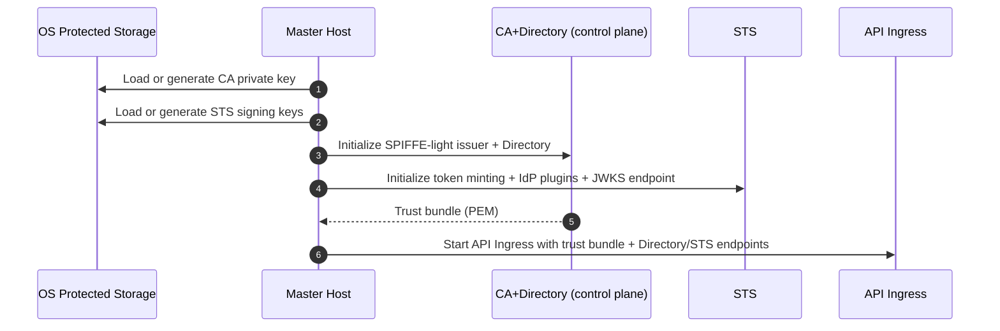
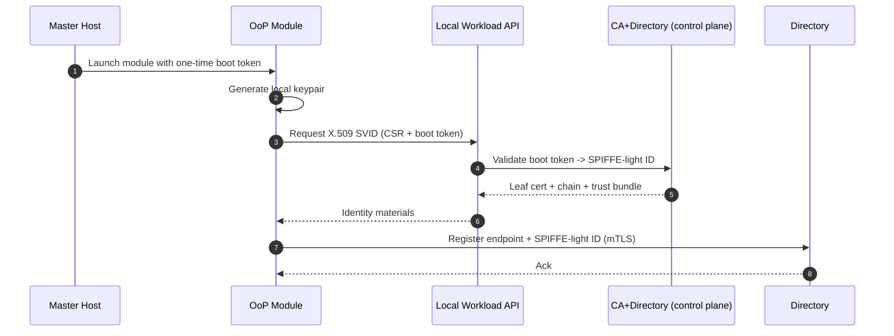
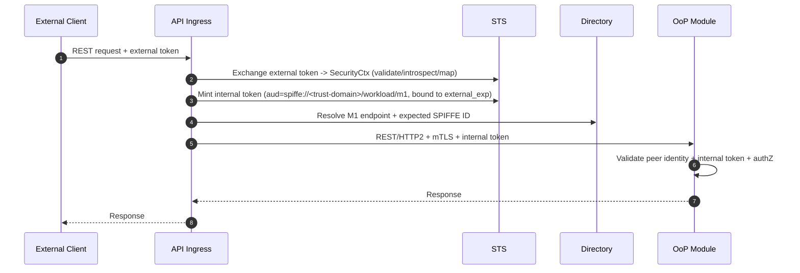
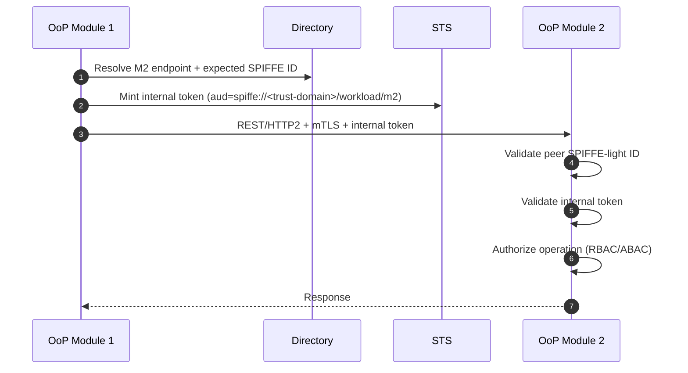
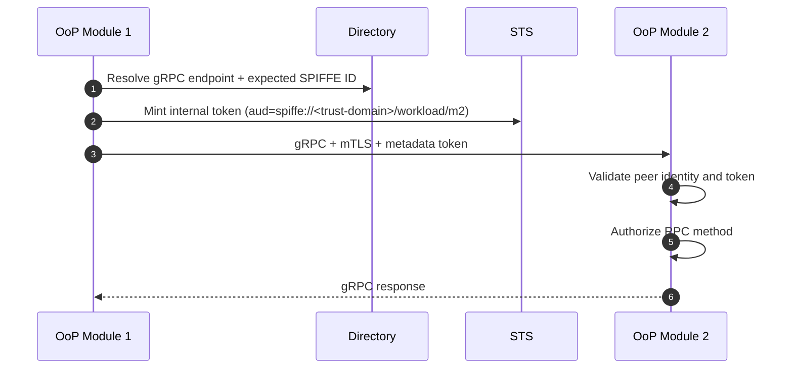

# Design Overview: Zero-Trust OoP Modules with SPIFFE-light and STS

Scope:

* On-prem targets: Windows, macOS.
* Cloud target: Kubernetes (Linux).
* HTTP/2 is the default transport; REST is the primary API style; gRPC is optional.
* OoP (out-of-process) modules.
* Zero-trust east-west traffic using mTLS (workload identity) plus a short-lived internal token (downscoped authorization context).
* External clients arriving with tokens issued by their own Identity Providers (IdP).

Control plane and data plane responsibilities are separated.

Aligned with Zero Trust principles in NIST SP 800-207. ([NIST Publications][2])

---

## Non-goals

* Replacing external IdPs or implementing login flows.
* Providing a service mesh (but the design stays compatible with one).
* Building full SPIRE attestation on-prem (this is why SPIFFE-light exists), but we keep a migration path.

---

## Glossary

* **SPIFFE ID**: URI identifier for a workload identity (`spiffe://<trust-domain>/<path>`). ([SpiFFE][3])
* **SVID**: SPIFFE Verifiable Identity Document. In practice here: X.509 certificate used for mTLS. ([SpiFFE][4])
* **Trust domain**: administrative boundary for identities and trust bundles. ([SpiFFE][3])
* **SPIFFE-light**: “SPIFFE-shaped identities + Workload API abstraction” without running SPIRE on-prem.
* **STS**: Security Token Service that normalizes external identity into canonical `SecurityCtx` and mints internal tokens.
* **Directory**: service discovery plus expected service identity (SPIFFE ID) for endpoints.
* **Control plane**: issues identities, policies, keys; authoritative state.
* **Data plane**: executes per-request enforcement; stateless and replaceable.

---

## Design principles (clarifications)

### SPIFFE-light is not a security model

SPIFFE-light role:

* **SPIFFE-light is an identity transport and naming convention, not a security model.**
* SPIFFE-light provides:
  * a standardized workload identifier format (SPIFFE ID),
  * a mechanism to prove that identity cryptographically (X.509 SVID via mTLS),
  * a trust bundle distribution concept.
* SPIFFE-light does **not** provide policy, authorization, or delegation by itself.

Zero Trust properties are enforced by policy + enforcement:

* mTLS proves *workload identity* (who is the caller workload).
* internal tokens minted by STS carry *authorization artifacts* and canonical context (what the caller is allowed to do, for which tenant, and for which audience).
* each module performs authorization decisions per operation.

### STS does not create identity

External identity originates at external IdPs (human login, device auth, external service auth).

**STS does not create identity. STS creates authorization artifacts bound to an already verified identity.**

STS role:

* It validates/normalizes external tokens (via IdP plugin logic).
* It performs token exchange and downscoping (audience restriction, TTL bounding, optional capability semantics).
* It mints short-lived internal tokens used inside the trust boundary.

---

## Threat model and security goals

### What we assume can go wrong

1. Network is hostile:

   * traffic can be observed, modified, replayed.
   * DNS/IP cannot be trusted for identity.

2. Any OoP module can be compromised:

   * a module may attempt to impersonate another module.
   * a compromised module may try lateral movement.

3. External tokens are untrusted inside:

   * internal services must not accept arbitrary external IdP tokens.

4. Directory is a high-value target:

   * poisoning Directory means routing to an attacker.

5. Keys leak eventually:

   * we must support rotation and fast blast-radius reduction.

### Security goals

* Every request is authenticated and authorized, regardless of network location (Zero Trust). ([NIST Publications][2])
* Workload identity is cryptographic (mTLS with SPIFFE-shaped IDs), not IP/DNS. ([SpiFFE][4])
* Canonical internal security context is consistent across protocols.
* Lateral movement is constrained by:

  * identity-bound mTLS, and
  * audience-bound internal tokens, and
  * explicit authorization policy.
* Operational safety:

  * rotation is routine, not a crisis.
  * failure modes are defined (STS down, Directory down, CA rotation, etc).

---

## Control Plane vs Data Plane

### Control Plane (decides and configures)

The control plane is authoritative and stateful. It owns identity, policy, and lifecycle decisions.

Components:

* Master Host / Module Orchestrator
* STS (Security Token Service)
* CA / SPIFFE-light issuer (workload certificates, trust bundle)
* Directory (service discovery and expected service identities)
* Configuration and key persistence (protected storage, secrets)

Responsibilities:

* External identity normalization
* Policy evaluation (tenants, access policies, entitlements)
* Internal token minting
* Workload identity issuance (certificates)
* Trust bundle and key rotation
* Module lifecycle and discovery

On-prem note:
For on-prem deployments, CA + Directory + STS may be implemented together inside the Module Orchestrator to reduce footprint. These remain logically separate control-plane responsibilities.

---

### Data Plane (executes per request)

The data plane is stateless, horizontally scalable, and replaceable.

Components:

* `api_ingress` (API gateway)
* OoP modules (REST/gRPC servers and clients)
* mTLS connections
* REST and gRPC request handling

Responsibilities:

* Request routing and proxying
* Cryptographic validation (TLS, token signatures)
* Rate limits and quotas (enforced in data plane; configured by control plane)
* Request/response transformation
* Observability (metrics, logs, tracing)

Important:
`api_ingress` is a data plane component. It MUST NOT own identity, policy, or lifecycle state.

---

## Why this design works well (Informative)

* Directory is the service discovery source of truth; identity is not derived from DNS/IP.
* External IdP token validation is limited to `api_ingress` and STS.
* East-west requests require workload identity (mTLS) and an internal token.
* SPIFFE/SVID provides workload identity transport; authorization is enforced by policy + token contents.

---

## Continuous monitoring, audit, and SIEM/SOAR integration (Required)

Minimum telemetry requirements for data plane and control plane.

### Audit event model (minimum)

Every enforcement point (`api_ingress`, each module server interceptor, STS, Directory) MUST emit structured audit events with:

* `timestamp`
* `trace_id` / `correlation_id`
* `tenant_id` (`tid`)
* `actor_subject` and `actor_type` (from `SecurityCtx`; treat as potentially sensitive/PII depending on IdP subject format)
* `peer_spiffe_id` (from mTLS) for internal calls
* `caller_spiffe_id` (from internal token; MUST match `peer_spiffe_id` unless a future delegation extension is implemented)
* `aud` (intended callee identity)
* `operation` (HTTP method + route template, or gRPC full method)
* `decision` (`allow|deny`)
* `reason_code` (stable enum; do not rely on free-text)
* `token_kid` and optional `jti` (careful with PII and log volume)

### Required metrics (examples)

* AuthN/AuthZ decisions: allow/deny counters by `reason_code`, `service_id`, `tenant_id`.
* Token minting: STS mint requests, cache hit ratio, failures by reason.
* External validation: JWKS refresh failures, introspection latency/errors.
* Directory: resolve latency/errors, cache hit ratio.
* mTLS failures: trust bundle mismatch, peer identity mismatch.

### SIEM/SOAR export (vendor-agnostic)

Audit events MUST be exportable to a central system (SIEM) and optionally actionable via SOAR.
Transport can be filebeat/agent, OTLP, syslog, or HTTP collector, but the schema MUST remain stable.

### Detection and alerting (minimum)

The platform SHOULD alert on:

* Spike in `deny` rate per service/tenant (possible misconfig or attack).
* Repeated failures for `caller_spiffe_id != peer_spiffe_id` (possible impersonation/lateral movement).
* High rate of unknown/rotated `kid` (key mismatch or attack).
* Introspection errors/timeouts above threshold (IdP outage or DDoS).
* Directory resolution anomalies (unexpected endpoint changes, frequent re-registrations).

---

## References: SPIFFE / SVID / SPIFFE-light

* SPIFFE overview ([SpiFFE][4])
* SPIFFE concepts: SPIFFE ID format, trust domain, Workload API ([SpiFFE][3])

In this design, SPIFFE-light ID means a SPIFFE-shaped workload identity without requiring SPIRE:

`spiffe://<trust-domain>/workload/<module-name>`

* It is an identity, not a DNS name.
* It is never resolved via DNS.
* Resolution is done via Directory.

SPIRE remains a future upgrade path. ([SpiFFE][5])

---

## Roles and Responsibilities

### Master Host (on-prem)

Control plane entry point:

* Hosts STS, CA (SPIFFE-light), Directory
* Starts and configures `api_ingress`
* Manages protected storage for long-lived keys

#### Key storage (on-prem) (Required)

Long-lived secrets (CA private key, STS signing keys, and any bootstrap/sealing keys) MUST be stored in **OS protected storage** and never in plaintext files.

Implementation note (TBD per platform):

* Windows: DPAPI / CNG / TPM-backed key storage
* macOS: Keychain / Secure Enclave where available
* Linux on-prem: OS keyring or a local HSM/TPM integration

TODO: Specify concrete APIs and threat model per supported OS (backup/restore, key export policy, operator access).

On-prem simplification:

* CA and Directory may be implemented together to reduce footprint.

### Kubernetes (cloud)

Same logical roles, different primitives:

* CA may be internal or cluster-managed (e.g. cert-manager).
* Keys and bundles stored in Secrets or external KMS.
* Directory and STS roles are unchanged.

### STS with IdP plugins

STS contains pluggable adapters per external IdP:

* OIDC JWT
* OAuth2 introspection
* Custom enterprise IdPs

Each plugin:

* Maps external claims into canonical `SecurityCtx`
* Applies tenant and access policies
* Mints short-lived, audience-bound internal tokens

STS is strictly control plane:

* No login flows
* No refresh tokens
* No user sessions

#### External IdP vs STS (normative distinction)

**External IdP and STS are different roles.**

**External IdP**

* Authenticates a human user or an external service.
* Issues an **external token** (JWT or opaque access token).
* Does not know internal service topology, internal SPIFFE IDs, or internal authorization semantics.

**STS**

* Does **not** authenticate the user.
* Is **not** the source of identity.
* Performs **token exchange + downscoping** for internal use.
* Issues an **internal capability token** (short-lived, audience-bound, internal-only semantics).

Normative statement:

> STS is not the source of identity.  
> STS performs token exchange and issues internal authorization artifacts.

### STS API sketch (Draft)

The following STS APIs are recommended to make responsibilities explicit and implementation testable.

#### `POST /v1/exchange` (external token → `SecurityCtx`) (Draft)

Called by: `api_ingress` only (boundary). Auth: mTLS (SPIFFE ID).

Request (draft):

* `external_token`: bearer token string
* `requested_audience`: callee SPIFFE ID (optional; can be used for policy)
* `trace_id` (optional; if not provided, STS generates one)

Response (draft):

* `security_ctx`: canonical `SecurityCtx` (or subset)
* `external_exp`: expiry timestamp observed/validated by STS (used to bound internal TTL)
* `decision`: allow/deny + reason code (optional if deny represented as error)

Errors (draft):

* `EXT_TOKEN_INVALID` / `EXT_TOKEN_EXPIRED` / `EXT_TOKEN_REVOKED`
* `STS_UNAVAILABLE`

TODO: Define exact JSON schema and stable error codes for this endpoint.

#### `POST /v1/mint` (mint internal token for `aud`) (Draft)

Called by: `api_ingress` and internal modules. Auth: mTLS (SPIFFE ID).

Request (draft):

* `aud`: callee SPIFFE ID
* `ctx_ref` / `ctx_fingerprint`: reference to a previously exchanged/derived `SecurityCtx` (for internal calls)
* `security_ctx`: canonical `SecurityCtx` (boundary-only: `api_ingress` caller)
* `external_exp` (optional; if provided, STS bounds TTL; if absent, STS uses policy_max_ttl only)

Rules:

* Internal modules MUST NOT submit arbitrary `security_ctx` blobs for minting.
* For internal mint calls, STS MUST derive mint input from the caller’s authenticated context (caller-presented internal token / previously exchanged context) and MUST accept only `ctx_ref` / `ctx_fingerprint` (or equivalent safe reference).
* For boundary mint calls where `security_ctx` is accepted, STS MUST validate schema, canonicalization, and size limits, and MUST enforce consistency with caller authorization.

Response (draft):

* `token`: internal bearer token
* `exp`: expiry timestamp

Errors (draft):

* `NOT_AUTHZ` (caller not allowed to mint for this `aud`)
* `EXT_TOKEN_INVALID` (if mint is derived from an invalid external context)
* `STS_UNAVAILABLE`

TODO: Specify caching hints (e.g. `cache_until`), stampede protection, and whether `security_ctx` is embedded (`ctx`) vs referenced.

### External IdP token handling (Required)

External identity is accepted **only at the boundary** (`api_ingress`) and normalized by STS plugins.
Internal services and modules MUST NOT validate or accept external IdP tokens directly.

Normative split of responsibilities:

* `api_ingress` is the boundary enforcement point (PEP): it accepts the external access token and delegates **all** token validation/introspection/claim mapping to STS.
* STS is the boundary decision + issuer component: it performs external validation + normalization and returns canonical `SecurityCtx` and/or minted internal tokens.

`api_ingress` MAY perform only cheap syntactic checks (presence, size limits, basic format) for early rejection, but MUST NOT interpret external claims for authorization.

#### Supported external token types

`api_ingress` and STS plugins MUST support the following (your environment may enable a subset):

1. **OIDC/OAuth2 access token as JWT** (signed): offline validation using IdP JWKS.
2. **OAuth2 access token as opaque string**: online validation via IdP **introspection**.

#### Refresh tokens (explicitly out of scope)

This system MUST NOT accept, store, forward, or manage refresh tokens.
Refresh token lifecycle (storage, rotation, theft protection) is owned by the external client and/or external IdP SDK/agent.

---

## UI / Browser session lifecycle (Required)

UI request/session requirements.

### Token types and boundaries

* **UI refresh token** (browser/app session): owned by the external client + external IdP SDK/agent. This platform MUST NOT see it.
* **UI access token**: short-lived external token presented to `api_ingress` at the boundary.
* **Internal token**: short-lived token minted by STS for internal service-to-service calls and for `api_ingress` → modules.

### Where `SecurityCtx` comes from for a user request

For a user-initiated request, STS maps the external token (JWT claims or introspection response) into `SecurityCtx`, plus boundary-generated trace/audit fields. Modules reconstruct `SecurityCtx` from the internal token on every hop.

### UI request lifecycle (informative)

1. UI obtains/refreshes an **access token** from external IdP (using refresh token owned by UI/SDK).
2. UI calls `api_ingress` with `Authorization: Bearer <external_access_token>`.
3. `api_ingress` calls STS:
   * `POST /v1/exchange` to validate/introspect and produce canonical `SecurityCtx` (or a derived representation).
   * `POST /v1/mint` to mint internal token(s) for the target audience(s).
4. `api_ingress` routes to internal module over authenticated channel and presents the internal token.
5. If the UI access token expires/revokes:
   * `api_ingress` fails closed (via STS deny).
   * UI obtains a new access token from IdP and retries.

#### What happens when the external access token expires/revokes (Required)

If the external access token expires or is revoked:

* `api_ingress` MUST reject requests with an expired/revoked external token (fail closed).
* STS MUST refuse to mint internal tokens derived from an expired/revoked external token.
* Internal modules MUST NOT attempt to contact the external IdP and MUST NOT attempt to refresh external tokens.

Expected client behavior (informative):

* The external client obtains a fresh access token from its IdP (typically via refresh held by the client/SDK).
* The client retries the request with the new access token; `api_ingress` normalizes it and mints new internal tokens as needed.

TBD (design choice for future iterations):

Long-running operations:

* Internal tokens MUST NOT be treated as a user session mechanism.
* A long-running operation that outlives a single external access token MUST use either:
  * re-auth at checkpoints (client provides a fresh external token), or
  * a separate non-user principal/token explicitly modeled and authorized (e.g., job/workload principal).

#### JWT validation requirements (normative)

When the external token is a JWT, the STS plugin (invoked by `api_ingress`) MUST:

* Verify signature against IdP JWKS (`kid` resolution, bounded cache).
* Enforce an allow-list of acceptable algorithms (reject `none` and unexpected `alg`).
* Verify standard claims:
  * `iss` matches configured IdP issuer.
  * `aud` contains the expected audience for this boundary (do not accept “any audience”).
  * `exp` is in the future (with bounded clock skew).
  * `nbf` (if present) is satisfied (with bounded clock skew).
  * `iat` is not unreasonably far in the future.
* Extract canonical subject and tenant inputs from claims (see mapping below).

If JWT revocation checks are available (introspection for JWT, revocation events, or a revoked-`jti` feed), the plugin SHOULD use them.
If not available, revocation is bounded by `exp` (this limitation MUST be documented operationally).

#### Introspection requirements for opaque tokens (normative)

When the external token is opaque, STS plugin MUST validate it via IdP introspection:

* Use HTTPS with strict TLS validation.
* Apply short timeouts and bounded retries (avoid IdP outages turning into a cascade).
* Treat “introspection unavailable” as **fail-closed** for new requests that cannot be satisfied from a bounded cache.
* Cache positive introspection results for a short duration, bounded by the token’s remaining lifetime.
* Use `active=false` (or equivalent) as a hard deny.

#### Claim mapping: external token → canonical `SecurityCtx` (minimum)

STS plugin MUST produce a canonical `SecurityCtx` using a deterministic mapping. Example minimum mapping:

| `SecurityCtx` field | Source (JWT claim / introspection) | Notes |
|---|---|---|
| `tenant_id` | `tid` / `tenant` / custom claim | Required. If missing, deny. If ambiguous, deny. |
| `subject` | `sub` | Stable subject id. If missing, deny. |
| `actor_type` | constant (`user`) | External callers are modeled as `user` by default. |
| `roles` | `roles` / `groups` / `scp` | Normalize to a stable internal namespace; avoid raw IdP group names leaking across tenants. |
| `resource_scope` | `scope` / custom | Optional; use only if you enforce resource-level scoping. |
| `trace` fields | generated at boundary | Correlation ids for auditability. |

Mapping rules:

* Reject tokens that cannot be mapped to a unique `tenant_id`.
* Normalize roles/entitlements to an internal namespace (`tenant:<tid>:role:<name>` or similar) to avoid collisions across IdPs.
* Do not propagate arbitrary external claims into internal tokens; only propagate the minimal canonicalized set used for authZ.

---

## Transport and Identity (Required)

### Workload identity source of truth

* Workload identity MUST be derived from X.509 URI SAN (SPIFFE ID).
* CN MUST NOT be used for identity.
* DNS/IP MUST NOT be used for identity.

### Transport requirements

All east-west traffic MUST be authenticated. Whether this is **mTLS** or **local-only authenticated IPC** depends on the deployment model (see Deployment models matrix below).

Normative baseline:

* If traffic can traverse a network namespace boundary (pod-to-pod, host-to-host, cross-node), **mTLS MUST be used**.
* If the channel is local-only IPC with strong OS access control (UDS / named pipes) and both ends are within the same host trust boundary, **mTLS MAY be replaced** by process trust + short-lived internal tokens, but only if the threat model for that deployment accepts this tradeoff.

* Trust is established via trust bundle, not via network topology.
* Workload API MUST be local-only IPC (UDS / named pipes) and never exposed as a network service.

---

## Deployment models and trust boundaries (Required)

Components MAY be co-located or separated. Channel security requirements depend on deployment model.

### Deployment matrix (baseline)

| Deployment model | Processes | Typical channels | Is the channel network-hostile? | East-west authN | Notes |
|---|---:|---|---|---|---|
| Single process (dev / smallest on-prem) | 1 | in-memory calls | No | process trust + internal token checks (optional) | Useful for dev; weakest isolation |
| Multi-process, same host (on-prem) | 2+ | UDS / named pipes (preferred) or localhost TCP | “Mostly” (host-local) | mTLS recommended on TCP; optional on strict IPC | Use OS ACLs + hardening; still enforce tokens |
| Kubernetes pods (in-cluster) | 2+ per pod / multiple pods | pod-to-pod over network | Yes | mTLS required | Cross-namespace/cross-node must assume hostile network |
| Cross-node / cross-host (on-prem cluster) | 2+ | network | Yes | mTLS required | Required for lateral movement resistance |

Normative rule:

* If any hop uses TCP beyond strict local-only IPC, treat it as hostile and require mTLS (trust bundle + SPIFFE ID).

---

## Bootstrapping (On-prem, SPIFFE-light)

### Boot token

Modules are bootstrapped with a one-time boot token.

Requirements:

* Boot token MUST be single-use.
* Boot token MUST be short-lived (recommended 60-120 seconds).
* Boot token MUST be bound to module instance context (at minimum):

  * `module_name`
  * `module_instance_id`
  * `issued_at`
  * `nonce` (random salt)

### Bootstrap result

After successful bootstrap, the module receives:

* leaf X.509 SVID (mTLS client/server certificate)
* certificate chain
* trust bundle

From that point onward, module identity is proven only via mTLS.

---

## Bootstrap and first trust establishment (Required)

First trust establishment requirements.

### Boot token: who issues it and how it is delivered

* Issuer: **Master Host / Module Orchestrator** (control plane).
* Delivery: out-of-band at module launch time (e.g., process args/env, inherited handle, or OS-protected IPC). It MUST NOT be logged or written to plaintext files.
* Trust basis: the Master Host is already trusted by the operator and is anchored in OS protected storage (see Key storage requirements).

### First-start scenario (informative)

1. Operator installs/starts Master Host.
2. Master Host loads or generates long-lived control plane keys in OS protected storage (CA key, STS signing keys).
3. When launching a new module instance, Master Host creates a boot token bound to:
   * `module_name`, `module_instance_id`, `issued_at`, `nonce`, and TTL.
4. Module generates a local keypair and calls the local Workload API (IPC) with CSR + boot token.
5. CA validates boot token and issues X.509 SVID + chain + trust bundle to that module instance.
6. Module registers itself in Directory using its newly issued identity.

* After bootstrap, the boot token MUST NOT be reused. Ongoing identity proof is by workload identity (SVID) and request-scoped internal tokens.

### External token: who issues it

* Issuer: **external IdP** (out of scope for this system).
* Delivery: obtained by the external client (UI/app/service) via external IdP flows.
* The external token is untrusted input at the boundary and is validated only via STS plugins invoked by `api_ingress`.

---

## Canonical Security Context

### `SecurityCtx` (conceptual)

Canonical `SecurityCtx` reconstructed from internal token on every hop:

* `tenant_id`: required (multi-tenant isolation)
* `subject`: stable user or service principal identifier
* `actor_type`: `user | workload | system`
* `roles` and/or `policies`: authorization inputs
* `resource_scope`: optional, if you enforce resource-level scoping
* `trace` fields (optional): trace/correlation ids for auditing

Rule: modules must treat `SecurityCtx` as request-scoped, not global state.

### `SecurityCtx` schema (Draft)

TODO: Define this as a versioned, language-agnostic schema (JSON Schema / Protobuf), and keep it stable across REST and gRPC.

UNDER DESIGN (tenant model):

* The internal token MUST carry a single **effective tenant** (`tid`) that scopes the current request for routing, isolation, and auditing.
* The authorization `scope` may represent a *set* of tenants/resources derived from the effective tenant (e.g., tenant hierarchy).
  This derivation is intended to be resolved by a dedicated **Tenant Resolver** service during STS exchange/mint.
  If a Tenant Resolver participates in STS exchange/mint, it becomes an authorization input and MUST follow the same transport/auth/audit/fail-closed requirements as STS.

TODO: Specify whether multi-tenant operations are allowed per request. Default assumption: requests are evaluated within one effective `tid`.

Draft shape (illustrative only):

* `ctx_ver`: integer version
* `tenant_id`: string (required)
* `subject`: string (required)
* `actor_type`: enum (`user|workload|system`) (required)
* `roles`: array of strings (optional)
* `entitlements`: array of strings or objects (optional)
* `resource_scope`: object or array (optional)
* `risk`: object (optional; if used for context-aware authZ)
* `trace`: `{ trace_id, span_id, request_id }` (optional)

TODO: Specify canonicalization rules so `ctx_fingerprint` is deterministic (field ordering, normalization, omission of nulls), and define what counts as PII.

---

## Internal token format and rules (Required)

Internal token is minted by STS and consumed by modules and `api_ingress`.

### Required claims

* `iss`: STS issuer id
* `caller_spiffe_id`: caller workload identity (SPIFFE ID); MUST match `peer_spiffe_id` from mTLS on every hop
* `aud`: callee workload identity (SPIFFE ID)
* `exp`: short TTL (minutes, not hours)
* `iat`: issued-at
* `jti`: unique id (supports replay detection if you add a cache)
* `tid`: effective tenant id for this request (Required)
* `scp` or `roles`: authorization inputs
* `ctx`: canonicalized SecurityCtx payload (or a minimal subset required for authZ); MUST include `subject` (actor subject) and `actor_type`

Notes:

* `caller_spiffe_id` exists only to bind the token to the transport workload identity and to disambiguate audit fields; it is not an alternative identity source.
* If you embed `ctx`, you may optionally include `ctx_hash` for debugging or integrity checks.
* Token format may be JWT or PASETO, but requirements above remain the same.

Invariant:

* `tid` MUST equal `ctx.tenant_id`. A mismatch MUST be treated as an invalid token.

UNDER DESIGN (scope expansion):

* `ctx.scope` may be expanded from `tid` via a Tenant Resolver (e.g., tenant hierarchy) to support server-side filtering of resources (tasks, etc.).
* TODO: Decide representation: explicit lists vs compressed scope vs `scope_ref`/`scope_hash` with TTL and a resolver cache.

### Internal token lifetime and SecurityCtx freshness (Required)

Rule: internal tokens are **ephemeral** and MUST be minted with a lifetime that is never longer than the remaining validity of the external token (when an external token exists).

Normative TTL rule:

* Let `policy_max_ttl` be a small value (recommended 1–5 minutes).
* Let `external_exp` be the validated external access token expiry (from JWT `exp` or introspection response).
* Let `skew` be a bounded clock skew (recommended 30–120 seconds).

Then:

* `internal_exp = min(now + policy_max_ttl, external_exp - skew)`

If `external_exp - skew <= now`, STS MUST NOT mint an internal token.

SecurityCtx freshness model:

* `SecurityCtx` MUST be reconstructed from the **internal** token on every hop (request-scoped).
* “Updating SecurityCtx” means **minting a new internal token** (which triggers re-evaluation of current external token status and policies/entitlements in STS).

Clarification (runtime):

* Inside the trust boundary, services/modules **do not** validate external tokens and **do not** call the external IdP.
* `SecurityCtx` “expires” when the **internal** token expires; on the next outbound call, the client middleware must mint a fresh internal token from STS.
* If the external token is expired or revoked, STS refuses to mint, so the internal context cannot be refreshed and requests fail closed.

### External token revocation propagation (Required when available)

If the IdP supports revocation checks (opaque token introspection, JWT introspection, revocation events, or a revoked-`jti` feed), STS plugin MUST treat a revoked/inactive external token as **hard deny** and MUST NOT mint internal tokens.

Operational note:

* For opaque tokens, revocation is enforced via introspection (`active=false`).
* For JWT tokens, “near real-time revocation” requires an IdP mechanism beyond offline signature validation. If such a mechanism is not available, revocation is bounded by JWT `exp`.

### STS caller authentication (Required)

STS accepts token-minting requests only via mTLS:

* STS MUST require mTLS.
* STS MUST identify caller by SPIFFE ID from peer certificate URI SAN.
* STS MUST enforce policy defining which callers may mint tokens for which audiences (`aud`).

### Token binding to mTLS (Recommended)

Token binding baseline:

* Include a `cnf` claim containing a SHA-256 thumbprint of the client certificate (base64url, no padding).
* Claim shape:
  * `cnf: { "x5t#S256": "<b64url(sha256(DER(cert)))>" }`
* Server verification:
  * Compute `sha256(DER(client_cert))` from the presented mTLS client certificate.
  * Compare to `cnf["x5t#S256"]`.
  * On mismatch, deny with reason code `TOKEN_BINDING_FAIL`.
* If the client certificate rotates, previously minted bound tokens become invalid and clients MUST mint new tokens.

If you do not implement binding, compensate with:

* very short TTL,
* strict `aud`,
* strict peer SPIFFE ID checks,
* and aggressive rotation.

### Key distribution

* STS publishes a JWKS-like key set for verification (by `kid`).
* Data plane caches keys with bounded lifetime.
* Rotation must be supported without downtime (old and new keys overlap for a grace window).

---

## East-west request validation (Required)

Every internal request uses both mTLS and an internal token.

### Server-side checks (normative)

For every inbound request (REST or gRPC), server interceptor MUST:

1. Validate peer mTLS identity:

   * validate chain to trust bundle
   * extract `peer_spiffe_id` from URI SAN

2. Validate internal token:

   * verify signature via `kid`
     * on unknown `kid`, verifier MUST attempt a single bounded JWKS refresh; if still unknown, deny with `BAD_TOKEN_SIG`
   * verify `iss`, `aud`, `exp`, `iat`
   * verify `aud` equals the server SPIFFE ID (from the server SVID)

3. Bind token identity to mTLS identity:

   * verify that `token.caller_spiffe_id` equals `peer_spiffe_id`

4. If token binding is enabled:

   * verify token confirmation claim matches presented client certificate

5. Reconstruct canonical `SecurityCtx` from token and store in task-local for request scope.
   * verify `tid == ctx.tenant_id`

Fail-closed rule:

* Missing or invalid token or invalid mTLS MUST reject the request.

### Reference pseudocode: inbound interceptor (informative)

```text
fn handle_inbound(request):
  peer_cert = tls.peer_certificate()
  peer_spiffe_id = extract_uri_san_spiffe_id(peer_cert)
  assert(peer_spiffe_id is not None) else deny("NO_PEER_SPIFFE_ID")

  server_cert = tls.local_certificate()
  server_spiffe_id = extract_uri_san_spiffe_id(server_cert)
  assert(server_spiffe_id is not None) else deny("NO_SERVER_SPIFFE_ID")

  token = parse_bearer_token(request.headers["Authorization"])
  claims = verify_internal_token(token, jwks_cache)
  assert(claims.iss == STS_ISSUER) else deny("BAD_ISS")
  assert(claims.aud == server_spiffe_id) else deny("BAD_AUD")
  assert(now < claims.exp) else deny("TOKEN_EXPIRED")

  // bind token caller identity to channel identity
  assert(claims.caller_spiffe_id == peer_spiffe_id) else deny("CALLER_SPIFFE_MISMATCH")

  if token_binding_enabled:
    assert(verify_confirmation_claim(claims, peer_cert)) else deny("TOKEN_BINDING_FAIL")

  ctx = reconstruct_security_ctx(claims.ctx)
  assert(ctx.tenant_id is not None) else deny("NO_TENANT")
  assert(ctx.tenant_id == claims.tid) else deny("TID_CTX_MISMATCH")

  // module-specific authorization
  assert(authorize(ctx, request.operation, request.resource)) else deny("NOT_AUTHZ")

  return next_handler(request, ctx)
```

---

## Authorization model (authZ), not optional

Authentication answers “who are you”. Zero Trust requires “are you allowed to do this right now”.

### Where policy lives

* Policy evaluation is a control plane responsibility (STS or a dedicated Policy Engine).
* Data plane enforces the decision per request using internal token contents and `SecurityCtx`.

### Authorization decision points (Required)

Decision points:

* **Boundary (north-south)**:
  * `api_ingress` is the Policy Enforcement Point (PEP).
  * STS (or a dedicated policy engine behind it) is the decision and minting component that produces internal authorization artifacts (PDP-like role).
* **East-west (service-to-service)**:
  * each module server interceptor is a PEP for its own operations.
  * the module authorizes operations based on `SecurityCtx` + request context, deny-by-default.

Minimum decision inputs (per request):

* transport identity: `peer_spiffe_id` (from mTLS, or from authenticated local IPC identity)
* internal token claims: `iss`, `aud`, `exp`, `tid`, roles/entitlements, optional token binding
* request context: method/route/RPC, resource identifiers, requested tenant routing, risk/context fields (if used)

### Hybrid authorization semantics (RBAC + entitlements) (Required)

This design assumes a hybrid model:

* **RBAC** for coarse access (which endpoints/operations are even possible).
* **Entitlements / attributes** for constraints (tenant isolation, resource scoping, risk/device posture, feature flags).

#### Entitlements format (recommended)

Entitlements SHOULD be represented in a stable, namespaced format to avoid collisions across IdPs and tenants.
Examples:

* String permissions: `perm:<namespace>:<name>` (e.g. `perm:billing:invoice.read`)
* Tenant-namespaced permissions: `tenant:<tid>:perm:<namespace>:<name>`
* Structured (if you need parameters): `{"perm":"billing:invoice.read","constraints":{"region":"eu","risk_max":30}}`

Regardless of representation, the **evaluation semantics** must be deterministic and documented.

#### Conflict resolution and evaluation order (normative)

To avoid ambiguity, the system MUST define a single conflict strategy. Recommended baseline:

* **Deny-by-default**: if a request cannot be matched to an explicit allow rule, deny.
* **Deny-overrides**: explicit denies take precedence over allows.
* **Most-specific-wins**: if multiple rules match, the rule with the most specific scope (tenant+resource+operation) wins, unless a deny applies.

Evaluation inputs per request:

* Request metadata: operation (route/RPC), method, target resource ids, requested tenant.
* Transport identity: `peer_spiffe_id` (from mTLS).
* Token identity/context: `SecurityCtx` from internal token (`tid`, `subject`, `roles`, `entitlements`, `resource_scope`, optional `risk/device`).

#### Tenant isolation (required invariant)

Tenant isolation MUST be enforced at multiple layers:

* `api_ingress` MUST prevent cross-tenant routing based on resolved `tenant_id`.
* Every module MUST validate that any resource access is within `SecurityCtx.tenant_id` (and/or `resource_scope`) before performing the operation.

#### Context-aware decisions (optional, but supported)

If you incorporate signals such as device posture, location, or risk score, they MUST:

* be provided as explicit fields in `SecurityCtx` (or as entitlements with constraints),
* be evaluated deterministically by rules,
* be auditable (see logging section).

### Examples (informative)

Example 1: RBAC + entitlement on a REST route

* Request: `GET /v1/invoices/{id}`
* Required role: `role:billing.reader`
* Required entitlement: `perm:billing:invoice.read`
* Required scope: `resource_scope` must include `invoice:{id}` OR `tenant:{tid}:invoices:*`

Example 2: deny-overrides (incident response)

* If STS or data plane maintains a temporary denylist for `subject` or `jti`, any match MUST deny even if roles/entitlements allow.

### Minimal viable model

Pick one and document it clearly in code and schemas:

1. RBAC:

   * roles in token
   * mapping role -> allowed operations in module

2. ABAC:

   * attributes in token (`tenant_id`, `resource_scope`, `entitlements`)
   * policy engine outputs allow/deny and optional constraints

3. Hybrid:

   * roles for coarse access
   * ABAC constraints for tenant/resource scoping

### Required enforcement points

* `api_ingress` must enforce:

  * tenant boundary (no cross-tenant routing),
  * global quotas/rate limits,
  * coarse endpoint access if needed.

* Every module must enforce:

  * operation-level authorization (method, route, RPC),
  * resource-level scope if applicable (tenant + resource ids),
  * denial-by-default for unknown operations.

Rule: “validated token” is not “authorized request”.

---

## SDK and Middleware Responsibilities (Required)

### Client-side interceptors (outbound calls)

1. gRPC client interceptor

   * Reads task-local `SecurityCtx`
   * Requests an internal token from STS (audience = callee SPIFFE ID)
   * Attaches `Authorization: Bearer <internal-token>` as gRPC metadata

2. REST client middleware

   * Reads task-local `SecurityCtx`
   * Requests an internal token from STS (audience = callee SPIFFE ID)
   * Attaches `Authorization: Bearer <internal-token>` as HTTP header

Token minting should be cached per `(aud, ctx_fingerprint)` until near expiry to avoid hammering STS.

TODO: Specify concrete caching parameters:

* `refresh_before_expiry`: e.g. refresh when remaining TTL < 20% or < 30s
* jitter: randomize refresh to avoid thundering herd
* max entries per process and eviction policy
* max STS QPS per module + backoff behavior
* behavior when STS is intermittently unavailable (use cached token until near expiry, then fail closed)

### Server-side interceptors (inbound calls)

3. REST and gRPC server interceptors

   * Validate peer mTLS identity (trust bundle, extract peer SPIFFE ID)
   * Validate internal token (`kid`, signature, `iss`, `aud`, `exp`, `iat`)
   * Enforce `token.caller_spiffe_id` equals peer SPIFFE ID
   * Apply token binding checks if enabled
   * Reconstruct canonical `SecurityCtx`
   * Store `SecurityCtx` in task-local storage for request scope

### Boundary rule

4. External tokens are accepted only at the boundary

   * External tokens are validated only in `api_ingress`
   * Internal services never accept external IdP tokens
   * Everything inside uses canonical internal tokens

---

## Directory requirements (security-critical)

Directory is not “just service discovery”. It is an authorization input and must be protected accordingly.

### Directory data model (minimum)

For each service endpoint:

* `service_id` (logical name)
* `spiffe_id` (expected server identity; SPIFFE ID)
* `owner_spiffe_id` (SPIFFE ID; required owner identity for the `service_id`)
* `endpoints` (host:port, protocol)
* `status` and `last_heartbeat` (optional but practical)
* `allowed_callers` (optional, strongly recommended)

  * list of caller SPIFFE IDs or groups allowed to call this service

### Ownership (Required)

* Each `service_id` MUST have an `owner_spiffe_id`.
* Only the owner MAY register, update, or revoke endpoints for that `service_id`, unless an operator role is used (see Revocation).
* `owner_spiffe_id` MUST be provisioned by control plane configuration (or operator action) and MUST NOT be implicitly assigned by first registration in production.
* In dev deployments, Directory MAY default `owner_spiffe_id` on first registration.

### Register / update semantics (Required)

* Registration MUST bind the entry to the registering module identity:
  * Directory MUST set `spiffe_id` to the registering module’s peer SPIFFE ID from mTLS.
* Update MUST be explicit:
  * an update replaces the full endpoint set for the `service_id` (no implicit merge).
  * add/remove MAY be implemented as separate operations; if implemented, operations MUST be auditable and MUST respect ownership checks.

### Revocation (Required)

* Directory MUST support revocation of a `service_id` registration.
* A revoke operation MAY be performed by:
  * `owner_spiffe_id`, or
  * an operator role authorized by the control plane.
* After revoke, `resolve` MUST return no endpoints for that `service_id` until re-registered.

### Versioning and audit (Required)

* Directory responses SHOULD include a monotonic `revision` and a `ttl`.
* Directory MUST emit audit events for register/update/revoke with:
  * `timestamp`, `trace_id`, `service_id`, `owner_spiffe_id`, `spiffe_id`, `endpoints` (or endpoint count), `revision`, `decision`, `reason_code`.

### Client validation, caching, and mismatch behavior (Required)

* Clients MUST pin the expected Directory SPIFFE ID and use mTLS for Directory access.
* Clients MUST fail closed on:
  * missing/expired cache and Directory unavailable, or
  * mismatch between resolved `spiffe_id` and the server certificate SPIFFE ID on connection establishment.
* Cache use:
  * clients MAY use cached results until `ttl` expires;
  * after `ttl` expiry, if Directory cannot be reached, clients MUST fail closed (no stale-while-revalidate for new connections).

### Directory write access (Required)

Only authenticated modules may register:

* module registration MUST be authenticated using the issued identity (mTLS).
* registration MUST be restricted so a module can register only what it is allowed to register (service id constraints).
* Directory MUST store `spiffe_id` as the registering module’s peer SPIFFE ID.

### Directory read access

* data plane and modules may read, but:

  * Directory access MUST use mTLS
  * Directory SPIFFE ID SHOULD be pinned/verified by clients (expected identity)

### Directory API sketch (Draft)

TODO: Specify concrete API endpoints and a stable schema. Recommended minimum:

* `GET /v1/resolve?service_id=<id>` → `{ service_id, spiffe_id, endpoints[], ttl, revision }`
* `POST /v1/register` (mTLS only) → registers or replaces `{ service_id, endpoints[], metadata }` bound to the caller SPIFFE ID; ownership enforced
* `POST /v1/revoke` (mTLS only) → revokes `{ service_id }`; ownership/operator enforcement

Required client behavior:

* Pin `Directory` expected SPIFFE ID.
* Cache resolve results for `ttl` with jitter; fail closed when cache is missing/expired.

TODO: Define anti-poisoning controls: who can register which `service_id`, rate limits, replay protection, and how to revoke registrations in incident response.

---

## Lifecycle management and rotation (Required)

### Workload certificates (SVIDs)

* short-lived leaf certificates (hours to 1 day)
* trust bundle distributed as first-class artifact ([SpiFFE][6])
* automated renewal before expiry

### Trust bundle rotation (Minimum)

* CA publishes versioned trust bundles.
* data plane and modules must support overlap:

  * accept both old and new CA during grace window
  * switch to new CA as default for new connections

### STS signing key rotation (Minimum)

* publish new keys in JWKS-like set
* overlap window: accept old signatures until max token TTL passes
* clients refresh keys periodically and on unknown `kid`

### Revocation strategy (Pragmatic on-prem)

Assume no OCSP unless explicitly implemented.

Practical approach:

* keep leaf TTL short
* rotate frequently
* if compromise is detected:

  * rotate CA and STS signing keys
  * invalidate Directory registrations
  * require module re-bootstrap

Optional incident-response deny-list:

* deny `caller_spiffe_id` or `jti` in data plane cache for bounded time
* use only for incident response, not as primary mechanism

---

## Incident response and revocation playbooks (Required)

Minimum “break glass” actions and real-time controls when compromise is suspected.

### Real-time containment levers (minimum)

1. **External token revoked/expired**
   * `api_ingress` MUST stop accepting it at the boundary.
   * STS MUST refuse minting internal tokens derived from it (revocation propagation).

2. **Internal token abuse**
   * Data plane SHOULD support a bounded denylist keyed by:
     * `jti` (replay/abuse of a single token), and/or
     * `caller_spiffe_id` (compromised caller identity)
   * Denylist TTL MUST be bounded (minutes) and used for incident response only.

3. **STS signing key compromise**
   * Publish new signing keys (new `kid`) and rotate.
   * Immediately stop publishing/accepting compromised key material (depending on policy).
   * Overlap window MUST not exceed the maximum token TTL for routine rotation; in compromise mode, overlap MAY be shortened.

4. **Workload identity compromise (module key theft)**
   * Invalidate Directory registration(s) for the compromised module instance.
   * Force re-bootstrap (new keypair + new SVID) for that module instance.
   * If blast radius is unclear, rotate the trust bundle / CA (with overlap strategy as documented).

### Detection-to-response workflow (example)

* Detect anomaly (SIEM alert): repeated `caller_spiffe_id != peer_spiffe_id`, token replay (`jti` reuse), or unexpected audience usage.
* Contain:
  * add `jti` or `caller_spiffe_id` to temporary denylist,
  * disable affected `kid` if applicable,
  * revoke external token in IdP if available.
* Recover:
  * re-bootstrap module(s),
  * rotate STS keys / CA if needed,
  * invalidate and re-register Directory entries.
* Post-incident:
  * tighten policies, reduce TTLs, add missing monitoring signals, document root cause.

---

## Failure modes (what happens when things break)

### STS unavailable

* Existing in-flight requests continue.
* New outbound calls:

  * use cached internal token until near expiry
  * if no valid cached token, fail closed with explicit error:

    * `503` for REST, `UNAVAILABLE` for gRPC
* Do not “skip token” just because STS is down.

### Directory unavailable

* Use cached endpoint mappings with TTL.
* If cache is missing or expired, fail closed.
* Log and emit metrics so it is visible quickly.

### CA / trust bundle unavailable

* Existing connections may remain valid until TLS session expires.
* New connections require trust bundle:

  * use cached trust bundle with TTL
  * if cache missing, fail closed

---

## Error handling and failure codes (Recommended)

To make fail-closed behavior consistent across REST and gRPC, use stable reason codes and map them to protocol-specific responses.

| Condition | Reason code | REST response | gRPC status | Notes |
|---|---|---|---|---|
| Missing/invalid peer SPIFFE ID | `NO_PEER_SPIFFE_ID` | 401 | `UNAUTHENTICATED` | mTLS misconfig or attacker |
| Invalid mTLS chain / trust bundle | `BAD_MTLS_CHAIN` | 401 | `UNAUTHENTICATED` | rotate trust bundles with overlap |
| Missing internal token | `NO_INTERNAL_TOKEN` | 401 | `UNAUTHENTICATED` | fail closed |
| Bad token signature / unknown `kid` | `BAD_TOKEN_SIG` | 401 | `UNAUTHENTICATED` | trigger JWKS refresh on unknown `kid` |
| Token expired | `TOKEN_EXPIRED` | 401 | `UNAUTHENTICATED` | client should mint fresh token |
| Bad issuer/audience | `BAD_ISS_OR_AUD` | 401 | `UNAUTHENTICATED` | misroute or attack |
| `tid` != `ctx.tenant_id` | `TID_CTX_MISMATCH` | 401 | `UNAUTHENTICATED` | token tampering or bug |
| `caller_spiffe_id` != `peer_spiffe_id` | `CALLER_SPIFFE_MISMATCH` | 401 | `UNAUTHENTICATED` | lateral movement attempt |
| Token binding failed | `TOKEN_BINDING_FAIL` | 401 | `UNAUTHENTICATED` | `cnf` mismatch or missing when required |
| AuthZ denied | `NOT_AUTHZ` | 403 | `PERMISSION_DENIED` | include `trace_id` for debugging |
| STS down (cannot mint) | `STS_UNAVAILABLE` | 503 | `UNAVAILABLE` | do not skip token |
| Directory down (cannot resolve) | `DIR_UNAVAILABLE` | 503 | `UNAVAILABLE` | use cached mapping only within TTL |
| External token invalid/revoked | `EXT_TOKEN_INVALID` | 401 | `UNAUTHENTICATED` | boundary-only check |

---

# Scenario 1. Master Host startup (On-prem)

Control plane initializes first. Data plane starts only after control plane is ready.



---

# Scenario 2. OoP Module startup and registration



---

# Scenario 3. External REST request (north-south)



---

# Scenario 4. Internal REST call (east-west, no ingress)



---

# Scenario 5. gRPC between modules



---

## Rust components and libraries

### TLS and certificates

* rustls: TLS and mTLS for REST/HTTP2 and gRPC
* rcgen: generation and signing of X.509 certificates (SPIFFE-light issuer)

### Tokens

* JWT or PASETO for internal tokens
* JWKS-like key distribution with `kid` for rotation

---

## Future compatibility: SPIRE and service mesh

SPIFFE-aligned:

* SPIFFE-shaped IDs
* Trust bundles as first-class artifacts ([SpiFFE][6])
* Workload API abstraction ([GitHub][7])

Migration path:

* Replace SPIFFE-light issuer with SPIRE ([SpiFFE][5])
* Replace local Workload API with SPIRE Agent Workload API
* Keep STS, internal tokens, interceptors, and policies unchanged

---

## Appendix: Why STS if we already have mTLS? (Recommended)

System uses workload identity (mTLS) and internal tokens.

### What mTLS gives you

* Strong cryptographic workload identity for the caller (`peer_spiffe_id`).
* Channel confidentiality/integrity on hostile networks.

mTLS alone does **not** provide:

* user/tenant context for user-initiated requests,
* downscoped, audience-bound authorization semantics,
* isolation from external IdP token formats and validation methods,
* uniform authZ inputs across protocols and services without coupling every service to every IdP.

### What STS adds (why it is not “just another JWT”)

STS provides:

* **token downscoping** (strict `aud`, bounded TTL, optional capability semantics),
* **internal-only semantics** (stable, versioned `SecurityCtx` mapping; minimal claim set),
* **format isolation** (opaque vs JWT external tokens stop at the boundary; internal services stay consistent),
* **centralized revocation propagation when available** (e.g., opaque token introspection),
* improved auditability (stable reason codes and canonical context).

### Alternative design (valid): mTLS identity + pass-through external token

An alternative is to use mTLS for workload identity and forward the external token deeper until an authorization point.

Tradeoffs:

* Pros: fewer moving parts; potentially lower latency on some paths.
* Cons (for this architecture):
  * internal services must understand external IdP tokens or depend on a shared validation library and IdP config,
  * revocation/introspection and claim mapping leaks inward,
  * coupling increases across tenants/IdPs and across protocol boundaries,
  * harder to keep a stable, minimal internal authorization context.

STS keeps external identity formats at the boundary and issues downscoped, internal-only authorization artifacts.

---

## Summary

* `api_ingress` is data plane only
* STS, CA, Directory are control plane
* External identity ends at the boundary
* Internal traffic is zero-trust, direct, and auditable
* AuthZ is explicit and required at every module boundary
* The system is ready for future scaling to SPIRE or a service mesh

---

## References

[2]: https://csrc.nist.gov/publications/detail/sp/800-207/final
[3]: https://spiffe.io/docs/latest/spiffe-about/spiffe-concepts/
[4]: https://spiffe.io/docs/latest/spiffe-about/overview/
[5]: https://spiffe.io/docs/latest/spire-about/spire-concepts/
[6]: https://spiffe.io/docs/latest/spiffe-about/spiffe-concepts/#trust-bundle
[7]: https://github.com/spiffe/spiffe/blob/main/standards/SPIFFE_Workload_API.md
